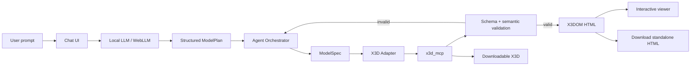
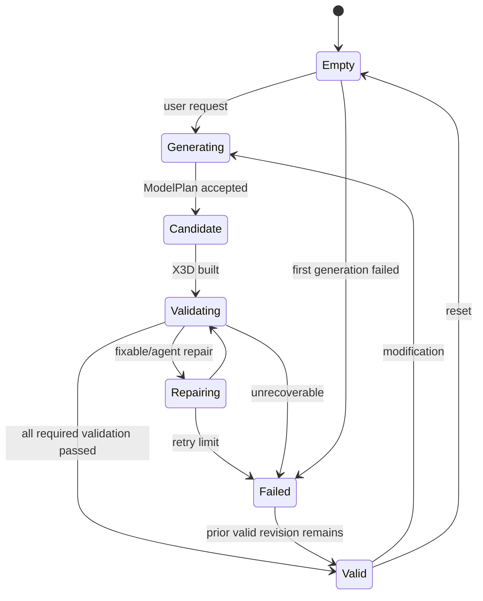

# AI Web3D Modeler: Product Requirements Document

## Software Requirements Specification

**Project:** AI Web3D Modeler  
**Document type:** Product Requirements Document (PRD): Full-Stack  
**Version:** 1.0  
**Last update:** 2026-09-22  
**Status:** Initial implementation specification / MVP baseline  
**Primary reference architecture:** Web3D Consortium `x3d_mcp`  
**Primary AI runtime (MVP):** WebLLM, local in-browser inference via WebGPU  
**Primary 3D representation (MVP):** X3D 4.x / X3DOM standalone HTML  
**Future evolution:** geometry IR → mesh/export pipeline → optional CAD adapter (CadQuery/OpenCascade)

---

## Table of Contents

- [1. Purpose and Scope](#1-purpose-and-scope)
- [2. System Context](#2-system-context)
- [3. Architecture Overview](#3-architecture-overview)
- [4. Functional Requirements: Backend and Domain](#4-functional-requirements-backend-and-domain)
- [5. Functional Requirements: Frontend](#5-functional-requirements-frontend)
- [6. End-to-End Use Cases](#6-end-to-end-use-cases)
- [7. Non-Functional Requirements](#7-non-functional-requirements)
- [8. Data Model and Integrity Rules](#8-data-model-and-integrity-rules)
- [9. API Contract and Error Standard](#9-api-contract-and-error-standard)
- [10. Frontend Component Specification](#10-frontend-component-specification)
- [11. Security and Access Control](#11-security-and-access-control)
- [12. Operational and Deployment Requirements](#12-operational-and-deployment-requirements)
- [13. Requirements Traceability Matrix](#13-requirements-traceability-matrix)
- [14. Product Roadmap and Scope Boundaries](#14-product-roadmap-and-scope-boundaries)
- [15. Implementation Maturity and Exit Criteria](#15-implementation-maturity-and-exit-criteria)
- [16. Appendices](#16-appendices)

---

## 1. Purpose and Scope

AI Web3D Modeler is a web application for conversational creation and modification of three-dimensional models. The user describes an object in natural language through a chat interface; an AI agent interprets the request, creates or modifies a structured geometry model, delegates valid X3D construction to the Web3D toolchain, validates the result, and presents the rendered 3D object beside the conversation.

The initial product is deliberately a **Web3D modeling system, not a mechanical CAD system**. Its MVP objective is to prove reliable natural-language-to-3D generation, iterative editing, validation, browser visualization, and downloadable artifacts without requiring a commercial CAD installation or paid AI API.

The project is designed so that the conversational layer and model intent are not tied permanently to X3D. A project-level intermediate geometry representation (`ModelSpec`) is retained as the semantic source of truth. The initial renderer converts that representation to X3D; future renderers may target mesh formats or a parametric CAD engine.

### 1.1 Product objectives

- Provide a single-page web workspace with **chat on one side and interactive 3D preview on the other**.
- Allow a user to request a 3D object using natural language.
- Allow iterative modifications such as “make the legs thicker”, “move the sphere up”, or “change the material to red” without recreating the whole conversation context manually.
- Use `x3d_mcp` as the authoritative X3D generation, query, validation, conversion, and HTML-rendering tool service.
- Avoid a mandatory paid LLM API in the MVP.
- Use a local browser LLM through WebLLM as the default AI runtime, requiring no developer API key and no per-request inference bill.
- Maintain an AI-provider abstraction so optional remote providers can be added later without changing domain logic.
- Validate generated X3D structurally and semantically before marking a generation successful.
- Generate a standalone `.html` artifact that the user can download and open in a modern browser.
- Allow downloading raw `.x3d` and, where supported, `.x3dj` and `.x3dv` representations.
- Preserve model intent independently from X3D so future STL/mesh/CAD export does not require rewriting the conversational agent.
- Establish a safe, testable agent loop in which the LLM produces structured commands rather than arbitrary executable code.

### 1.2 Non-goals for MVP

The first release does **not** promise:

- STEP export.
- Native SolidWorks/Fusion 360/FreeCAD project generation.
- Manufacturing tolerances or GD&T.
- Mechanical simulation, FEA, stress analysis, or CAM.
- Guaranteed watertight/manifold geometry suitable for manufacturing.
- True boolean holes/cuts for every shape.
- Parametric constraint solving comparable to a CAD sketcher.
- Photorealistic rendering.
- Multi-user collaboration.
- Cloud account management.
- Long-term server-side project persistence.
- Training or fine-tuning a proprietary LLM.

### 1.3 MVP product statement

> A user can open the web application, describe a 3D object, watch a local AI agent construct a validated X3D representation through controlled tools, view the resulting 3D model next to the chat, request modifications, and download the current model as standalone HTML and X3D.

### 1.4 Success criteria

The MVP is considered successful when:

1. A first-time user can generate a valid primitive-based scene without configuring an AI API key.
2. The system displays the generated model in the browser without requiring a browser plugin.
3. At least 90% of the maintained golden prompts produce X3D that passes schema and semantic validation after the automated correction loop.
4. The user can issue at least one follow-up modification to a named part without resetting the entire project.
5. Downloaded standalone HTML opens independently and displays the same current scene.
6. Raw X3D can be downloaded.
7. AI output cannot execute arbitrary Python, shell, or JavaScript on the backend.
8. The frontend does not expose server filesystem paths to the remote MCP service.
9. Provider switching is isolated behind a single `LLMProvider` interface.
10. The project can later add a second geometry renderer without changing the chat domain contract.

---

## 2. System Context

### 2.1 User problem

Creating even a simple 3D scene normally requires learning a modeling application, scene graph, scripting language, or modeling API. Generative LLMs can produce 3D-related code, but unrestricted code generation is unreliable: models may invent node names, use invalid fields, violate hierarchy rules, or return markup that is syntactically valid but semantically unusable.

The Web3D Consortium `x3d_mcp` project addresses this problem for X3D by exposing structured generation, node metadata, validation, scene manipulation, conversion, rendering, and guided workflows to LLM clients. AI Web3D Modeler turns those capabilities into an end-user web product.

### 2.2 Actors and roles

| Actor / role | Type | Primary capabilities |
| --- | --- | --- |
| End user | Human | Describe, inspect, modify, reset, and download a 3D model. |
| Local AI agent | System actor | Interpret user intent, create structured plans, select tools, inspect tool results, and decide whether correction is required. |
| WebLLM runtime | System actor | Execute the default local open-source LLM inside the browser through WebGPU. |
| Orchestrator API | System actor | Own project/session state, validate commands, expose application endpoints, and call `x3d_mcp`. |
| `x3d_mcp` | External/open-source system dependency | X3D generation, X3DUOM queries, scene state, validation, conversion, manipulation, X3DOM HTML generation, optional PNG rendering. |
| Browser 3D viewer | System actor | Display the generated X3D interactively in the application. |
| Optional remote AI provider | Future system actor | Fallback/opt-in inference when local WebLLM is unsupported or insufficient. |
| Future CAD adapter | Future system actor | Convert semantic model intent to a CAD representation such as CadQuery/OpenCascade. |

### 2.3 Conceptual product modules

| Module | Responsibility | MVP |
| --- | --- | --- |
| Conversational Workspace | Chat, request history, status, retry/cancel, modification prompts | Yes |
| Local AI Runtime | Model load, structured inference, streaming/status | Yes |
| Agent Orchestrator | Planning, tool loop, validation loop, failure recovery | Yes |
| ModelSpec Domain | Renderer-independent semantic representation of the current model | Yes |
| X3D Adapter | Convert ModelSpec operations to X3D tool calls | Yes |
| X3D Validation | XSD and semantic validation through `x3d_mcp` | Yes |
| Web3D Viewer | Interactive preview in browser | Yes |
| Artifact Export | HTML and X3D downloads; JSON/ClassicVRML where supported | Yes |
| Project Persistence | Local browser persistence of current project metadata | Limited |
| Cloud Accounts | User authentication/project cloud storage | No |
| Mesh Export | STL/glTF/GLB pipeline | Roadmap |
| CAD Adapter | Parametric CAD/STEP generation | Roadmap |

### 2.4 High-level user flow



### 2.5 Why X3D for the MVP

X3D is appropriate for the first release because it is an open, royalty-free 3D standard designed for publishing and interacting with 3D content on the Web. The selected `x3d_mcp` server already exposes structured tools for node creation, field assignment, scene composition, validation, conversion, semantic queries, animation, manipulation, and standalone X3DOM page generation.

The MVP therefore avoids building a 3D standards layer from scratch.

### 2.6 Why the MVP is not CAD yet

The first product validates conversational modeling and interaction, not manufacturing correctness. A visual object composed from X3D primitives may be adequate for browser visualization while still lacking:

- B-rep topology;
- dimensional constraints;
- construction history;
- true parametric features;
- manufacturing semantics;
- guaranteed manifold mesh;
- STEP interoperability.

The architecture preserves the option to introduce those capabilities later through a separate renderer/adapter.

---

## 3. Architecture Overview

### 3.1 Architectural style

- **Frontend:** React + TypeScript + Vite single-page application.
- **AI inference:** WebLLM in-browser through WebGPU, loaded in a Web Worker when supported.
- **Agent protocol:** application-defined structured JSON planning/execution; no dependence on unrestricted code generation.
- **Backend/API:** Python 3.12+ FastAPI application.
- **X3D service:** `x3d_mcp`, executed as a separate service using Streamable HTTP transport.
- **3D preview:** X3DOM standalone content rendered inside an isolated iframe; X_ITE may be used for optional validation/render snapshots.
- **State:** current project state held by backend session plus browser-side persisted metadata; no mandatory database in MVP.
- **Exports:** generated on demand from the current validated X3D state.
- **Deployment:** containerized services; frontend can be served statically; API and MCP can run in Docker.
- **Future rendering:** renderer interface allows X3D, mesh, and CAD adapters.

### 3.2 Proposed solution projects

| Project / directory | Runtime | Responsibility |
| --- | --- | --- |
| `apps/web` | React / TypeScript | Chat workspace, WebLLM, viewer, downloads, local project state. |
| `apps/api` | Python / FastAPI | Session/project orchestration, command validation, MCP client, artifact endpoints. |
| `packages/domain` | TypeScript/Python schema mirror | Shared ModelSpec/ModelPlan definitions and JSON Schema. |
| `packages/agent` | TypeScript | Local LLM provider interface, prompts, JSON parsing, repair loop. |
| `packages/viewer` | TypeScript | Preview iframe, camera reset, scene reload, viewer error handling. |
| `services/x3d-mcp` | Python 3.12+ | Upstream `x3d_mcp` dependency/service. |
| `tests/golden` | JSON/Markdown | Golden prompts and expected structural properties. |
| `docs` | Markdown | Architecture, ADRs, setup, model support, roadmap. |

### 3.3 Frontend architecture

```text
React SPA
  ├── WorkspacePage
  │   ├── ChatPanel
  │   ├── GenerationStatus
  │   ├── ViewerPanel
  │   └── DownloadMenu
  ├── LocalLLMProvider (WebLLM)
  │   └── Web Worker / model cache
  ├── AgentRuntime
  │   ├── prompt builder
  │   ├── structured output parser
  │   ├── tool-result loop
  │   └── retry/repair policy
  ├── API Client
  └── Local Project Cache
```

The frontend owns AI inference in the default MVP configuration. This keeps the AI path keyless and removes per-request server inference cost.

### 3.4 Backend architecture

```text
HTTP request
  → FastAPI endpoint
  → request/session validation
  → ProjectService
  → ModelSpec mutation / command validator
  → X3DMcpClient
  → x3d_mcp Streamable HTTP
  → validation
  → artifact assembly
  → JSON / HTML / X3D response
```

The API must never accept arbitrary Python source from the LLM and execute it. All AI actions are represented as a finite set of typed operations.

### 3.5 `x3d_mcp` integration

The project shall use upstream capabilities where they exist rather than reimplementing them.

Primary tools expected:

- `create_scene`
- `create_geometry`
- `compose_scene`
- `create_node`
- `set_field`
- `add_child`
- `add_route`
- `def_node`
- `use_node`
- `remove_node`
- `get_scene`
- `reset_scene`
- `validate_x3d`
- `validate_current_scene`
- `validate_semantic`
- `autofix_x3d`
- `convert_x3d`
- `describe_node`
- `list_nodes`
- `x3dom_page`
- scene manipulation operations
- optional `render_current_scene`

The integration must prefer `x3d_mcp` Streamable HTTP in development/production so each connected session receives isolated granular scene state.

### 3.6 AI runtime decision

#### Default: WebLLM

WebLLM is selected as the default MVP inference engine because:

- it runs inference directly inside the browser;
- it uses WebGPU acceleration;
- no external AI server is required;
- no API key is required;
- no per-request inference charge exists;
- it provides an OpenAI-like chat API;
- it supports structured JSON generation;
- model artifacts can be cached in the browser;
- it supports Web Workers.

Because first-class function calling remains an evolving capability, the MVP shall not require native model tool calls. The agent will request **JSON constrained to the project-defined `ModelPlan` schema** and the application will execute the operations itself.

#### Optional fallback: Puter.js provider

Puter.js may be provided as an opt-in fallback for unsupported hardware. It does not require the developer to manage provider API keys, but it uses a user-pays model and can require user authentication. It is therefore not the zero-cost default.

#### Rejected as default: Pollinations

Pollinations was considered because older/public descriptions emphasized free keyless access. Current API documentation requires authentication for generation endpoints and uses account/Pollen budgets. It therefore does not satisfy the current “100% keyless default” requirement.

### 3.7 LLM provider abstraction

```typescript
interface LLMProvider {
  id: string;
  isAvailable(): Promise<boolean>;
  initialize(): Promise<void>;
  generateStructured<T>(
    messages: AgentMessage[],
    schema: JsonSchema,
    options?: GenerationOptions
  ): Promise<T>;
  cancel?(): Promise<void>;
}
```

Initial providers:

- `WebLLMProvider` — required.
- `PuterProvider` — optional/future fallback.
- `OpenAICompatibleProvider` — future BYOK provider for testing/advanced users.

No domain or geometry code may call WebLLM directly outside the provider package.

**Implementation note (Issue #18, 2026-09-21):** Implemented in `packages/agent/src/provider.ts` (the `LLMProvider`/`AgentMessage`/`JsonSchema`/`GenerationOptions` types, matching this section's shape exactly), `packages/agent/src/webllm-provider.ts` (`WebLLMProvider`, `createWebLLMProvider`), and `packages/agent/src/mock-provider.ts` (`MockLLMProvider`). `PuterProvider`/`OpenAICompatibleProvider` remain unimplemented (future fallback/BYOK providers, not required for this issue). Concrete decisions this issue made:

- `WebLLMProvider` is a new, self-contained implementation, not a reuse of `apps/web/src/ai/webllm-runtime.ts` (Issue #16): that code is Phase-0 spike code (§14.1) written before this package existed and is still not wired into any UI, whereas this section already assigns "the provider package" as the only place allowed to call WebLLM directly. `detectWebGpu`/`createWorker`/`createEngine` are constructor-injected (the same DI shape Issue #16 used) so it is unit-tested without a browser, GPU, or model download.
- `generateStructured` uses `@mlc-ai/web-llm`'s own JSON mode (`response_format: { type: "json_object", schema: JSON.stringify(schema) }` on `engine.chat.completions.create`), not free-text prompting plus hopeful parsing.
- `WebLLMProvider` exposes a richer `getState()`/`onStateChange()` beyond the interface's boolean `isAvailable()` -- phases `idle`/`unsupported`/`loading`/`ready`/`generating`/`error` -- satisfying this issue's "provider exposes availability/init/structured-generation state" beyond what the interface itself requires. `generateStructured` called while not `ready` throws a descriptive error rather than silently queuing or guessing.
- `MockLLMProvider` takes an ordered array of scripted responses (a value, a JSON string so a test can script malformed JSON, or a function of the call's messages/schema); each `generateStructured` call consumes the next one, and exhausting the script throws rather than returning `undefined`.

### 3.8 ModelSpec intermediate representation

The application shall maintain a renderer-independent semantic model.

Example:

```json
{
  "version": "1.0",
  "units": "mm",
  "scene": {
    "background": "#f4f5f7"
  },
  "objects": [
    {
      "id": "seat",
      "name": "Seat",
      "kind": "box",
      "dimensions": {
        "width": 500,
        "height": 40,
        "depth": 500
      },
      "transform": {
        "position": [0, 450, 0],
        "rotation": [0, 0, 0],
        "scale": [1, 1, 1]
      },
      "material": {
        "color": "#8b5a2b"
      }
    }
  ]
}
```

The unit system is semantic metadata in MVP. X3D itself is unit-agnostic for generic coordinates; the adapter shall apply a configurable display scale to avoid unusably large browser scenes when users express dimensions in millimeters.

### 3.9 ModelPlan command contract

The LLM must produce operations, not code.

Example:

```json
{
  "intent": "modify_model",
  "summary": "Increase the thickness of the four legs.",
  "operations": [
    {
      "op": "set_dimensions",
      "target": "leg_front_left",
      "dimensions": {
        "width": 55,
        "depth": 55
      }
    }
  ]
}
```

Allowed operations for MVP are defined in Section 8.

### 3.10 Generation loop

```text
User message
  → LLM produces ModelPlan JSON
  → JSON Schema validation
  → semantic command validation
  → ModelSpec mutation
  → X3D rebuild/update
  → validate_current_scene
  → semantic validation
  → optional autofix
  → regenerate/repair if needed
  → x3dom_page
  → preview
  → expose downloads
```

The maximum automatic repair iterations shall default to 2 to avoid loops.

### 3.11 Preview isolation

Generated standalone HTML may execute X3DOM library code. The preview shall therefore be displayed in a sandboxed iframe using a generated Blob URL or `srcDoc`.

The main application shall not execute LLM-generated JavaScript.

### 3.12 Storage architecture

MVP does not require a database.

Browser persistence:

- selected local LLM model;
- WebLLM model cache handled by the library/browser;
- last project metadata;
- optional last `ModelSpec`;
- UI preferences.

Server memory:

- temporary project/session ID;
- current validated scene state;
- current ModelSpec mirror if backend is authoritative;
- validation diagnostics;
- artifact cache.

State may be lost when the backend restarts unless the user downloads the project artifact. Persistent cloud projects are post-MVP.

---

## 4. Functional Requirements: Backend and Domain

### FR-01 Project Session Creation

The system shall create an isolated modeling session when the user opens a new project. The response shall include a non-guessable project/session identifier used to associate ModelSpec state, MCP scene state, validation results, and generated artifacts.

### FR-02 ModelSpec Initialization

A new project shall start from an empty valid ModelSpec with version, unit system, scene metadata, and zero objects. ModelSpec validation shall occur before any renderer call.

### FR-03 Structured ModelPlan Acceptance

The API shall accept only ModelPlan operations matching the current JSON Schema. Unknown operations, unknown fields, malformed numeric values, invalid target IDs, or payloads exceeding configured limits shall be rejected before calling `x3d_mcp`.

### FR-04 Primitive Creation

The MVP shall support at least these primitive object kinds:

- box;
- sphere;
- cylinder;
- cone.

Each primitive shall have a stable internal ID, user-facing name, dimensions, transform, and material.

### FR-05 Object Transform

The system shall support translation, rotation, and scale changes on an existing object. Numeric values shall be finite and bounded to configured safety limits.

### FR-06 Object Dimensions

The system shall allow dimension updates appropriate to each primitive. For example:

- box: width, height, depth;
- sphere: radius;
- cylinder: radius, height;
- cone: bottomRadius, height.

Invalid negative/zero dimensions shall be rejected.

### FR-07 Material Color

The system shall support a base display color for each object. The domain accepts normalized hexadecimal colors; the X3D adapter converts them to the renderer representation.

### FR-08 Object Naming and Stable References

Each created part shall receive an immutable `id` and mutable display `name`. Follow-up instructions shall resolve targets by ID first and by unique display name second. Ambiguous names shall result in a clarification response rather than arbitrary mutation.

### FR-09 Object Deletion

A valid ModelPlan may remove an existing object. Deletion shall update ModelSpec and rebuild or update the X3D scene.

### FR-10 Object Duplication

The system shall support duplicating an existing primitive while assigning a new ID and allowing transform overrides.

### FR-11 Scene Reset

The user may reset the project. Reset shall clear ModelSpec objects, reset the MCP scene, remove generated artifacts, and preserve only project-level UI settings.

### FR-12 X3D Scene Generation

The X3D adapter shall translate current ModelSpec to valid X3D using `x3d_mcp` tools instead of generating unchecked raw XML through the LLM.

### FR-13 X3D Metadata Query

When an adapter requires node/field information that is not hardcoded in the adapter contract, it shall be able to query `describe_node` or related metadata tools rather than invent field semantics.

### FR-14 Schema Validation

Every successful scene generation shall run X3D schema validation before the result becomes downloadable.

### FR-15 Semantic Validation

Every successful scene generation shall run semantic validation for scene-level issues such as invalid hierarchy, field/container relationships, DEF/USE consistency, ROUTE consistency where used, and incomplete scene structures.

### FR-16 Automated X3D Autofix

When validation reports a known fixable issue supported by `autofix_x3d`, the orchestrator may apply the fix and revalidate. Automatic fixes shall be recorded in diagnostics.

**Implementation note (Issue #10, 2026-09-21):** Implemented as `apps/api/src/api/x3d_validation.py`. `build_and_validate_candidate(client, spec)` is the full pipeline: it builds the candidate via `x3d_adapter.apply_model_spec` (Issue #9), runs schema (`validate_x3d`) and semantic (`validate_semantic`) validation, attempts `autofix_x3d` and revalidates if invalid, and either returns `(def_names, ValidationResult)` on success or raises `X3DValidationError` -- returning nothing -- if the candidate is still invalid. Like `mutation.apply_plan` (Issue #7), rollback is a consequence of the function's contract (a caller only ever receives a result on success) rather than separate undo logic, so an invalid candidate cannot be mistaken for one safe to commit as the project's new revision (PRD FE-08). Concrete decisions this issue made:

- `ValidationResult` (`schema_valid`, `schema_errors`, `semantic_diagnostics`, `autofixes`, `content`) is the structured shape FR-23 describes; its `to_summary()` produces the exact `{schemaValid, semanticValid, warnings, autofixes}` JSON shape from §9.3/FR-23 (`warnings` folds both `warning`- and `info`-level semantic diagnostics, matching that flat shape having no separate `infos` field).
- `x3d_mcp`'s `validate_semantic` tool returns a markdown report, not structured data; `_parse_semantic_report` parses its `## Errors`/`## Warnings`/`## Info` sections and `- **[check]** message` bullets into typed `Diagnostic(level, check, message)` values. `semantic_valid` is `True` iff no `error`-level diagnostic is present -- `warning`/`info` diagnostics (e.g. the "unused-def" info every `x3d_adapter`-built DEF triggers, since none are ever `USE`'d) do not block validity.
- `autofix_x3d` only ever rewrites `containerField` attributes; scenes built through `x3d_adapter.apply_model_spec` always set them explicitly and correctly, so autofix has nothing to do for candidates reachable through the normal ModelSpec path in practice (proven instead against hand-authored X3D content in tests) -- and it cannot fix everything (e.g. a ROUTE naming a nonexistent field), which is exactly the case that should still surface as a validation failure.
- `X3DMcpClient` gained `validate_x3d(content, encoding)` and `autofix_x3d(content)`, the two remaining content-based `x3d_mcp` tools §9.5's table didn't yet cover.
- This issue's heavier integration coverage (many more `x3d_mcp` tool calls per test run than Issue #9's) exposed two real bugs in the `x3d_mcp_server` test fixture (`apps/api/tests/conftest.py`), fixed alongside: piping the server subprocess's stdout/stderr without ever reading them deadlocked the server once its own logging filled the OS pipe buffer partway through a full run (now redirected to `DEVNULL`, since nothing consumed the captured output); and on Windows, `Popen.terminate()` only signalled the immediate `uv run` process, leaving the actual `src/server.py` interpreter `uv` execs as its own child orphaned and still bound to the fixture's hardcoded port for every session afterwards (teardown now uses `taskkill /T` there).

### FR-17 Controlled Agent Repair Loop

If X3D generation remains invalid after supported autofix, the system may return diagnostics to the AI agent for up to two structured repair iterations. The LLM may update ModelPlan/ModelSpec but may not directly bypass validators.

### FR-18 Standalone HTML Generation

For every validated scene, the backend shall generate a standalone browser-viewable X3DOM HTML document using the upstream X3D rendering helper or equivalent vetted adapter.

**Implementation note (Issue #11, 2026-09-21):** Implemented as `apps/api/src/api/artifacts.py`. `build_html_artifact(client, project_id, revision, x3d_content, requested_revision)` wraps `X3DMcpClient.generate_x3dom_page` (the upstream `x3dom_page` tool, §9.5) and returns an `Artifact(filename, media_type, content)`. It is a pure function over its arguments -- it holds no project/revision state of its own -- so a generation failure (the underlying MCP call raising) simply propagates and never leaves any stored "current revision" touched, satisfying "generation failure does not invalidate X3D revision" by construction rather than by explicit rollback code. `requested_revision` is mandatory (mirroring `ProjectSessionService.commit_revision`'s `expected_revision`, Issue #8): a mismatch against `revision` raises `StaleArtifactRequestError` *before* any MCP call is made, so a stale request never even reaches HTML generation. `normalized_artifact_filename(project_id, revision, extension)` implements FR-21's `chair-r0007.x3d` convention (`{name}-r{revision:04d}.{extension}`); `project_id` stands in for the FE-12 user-assigned project name, since that name is frontend-only state not yet part of `ModelSpec`/`ProjectSession` (revisit this helper's first argument once project naming lands).

### FR-19 X3D XML Export

For every validated scene, the system shall expose downloadable `.x3d` XML content.

**Implementation note (Issue #12, 2026-09-21):** Implemented in the same `apps/api/src/api/artifacts.py` module as Issue #11. `build_x3d_artifact(project_id, revision, x3d_content, requested_revision)` is a synchronous pure function -- the already-validated `ValidationResult.content` from Issue #10's pipeline is the X3D XML, so no further MCP call or parsing is needed to serve it. The same mandatory `requested_revision` check as Issue #11 enforces FR-22's "never silently return a prior revision"; tests additionally round-trip a downloaded artifact's content back through `validate_x3d` to prove it revalidates as-is.

### FR-20 Additional X3D Encoding Export

Where upstream conversion succeeds, the system shall allow `.x3dj` JSON and `.x3dv` ClassicVRML downloads.

**Implementation note (Issue #13, 2026-09-21):** Implemented in `apps/api/src/api/artifacts.py`. `build_converted_artifact(client, format, project_id, revision, x3d_content, requested_revision)` wraps the upstream `convert_x3d` tool (now on `X3DMcpClient`) for both `x3dj` and `x3dv`; same mandatory `requested_revision` check as Issues #11/#12. Concrete discovery this issue made: the pinned `x3d_mcp` commit's `convert_x3d(to_encoding="json")` has a pre-existing upstream bug in the vendored `x3d` pip package's `X3D.JSON()` serializer -- it never produces well-formed JSON, for any scene including an empty one (the vendored server's own test suite only asserts substrings like `"X3D" in json_out`, never that the result parses, so this was never caught upstream either). Rather than silently downloading corrupt `.x3dj` content, `build_converted_artifact` parses the tool's output with `json.loads` before returning success and raises `ArtifactConversionError` if it doesn't parse -- this is what "where upstream conversion succeeds" and "conversion errors are isolated from base X3D artifact" mean in practice today: `.x3dj` is currently unavailable for every revision (a caller should omit it from the UI), `.x3dv` works normally. This is tracked as an upstream limitation, not something to patch inside `services/x3d-mcp/vendor` (a pinned dependency) -- revisit if the pinned commit is ever bumped past a fix.

### FR-21 Artifact Versioning

Each successful model mutation shall increment a project revision number. Download responses shall include the current revision in metadata and may include it in filenames.

Example:

`chair-r0007.x3d`

### FR-22 Artifact Reproducibility

The artifact shall be generated from the current validated ModelSpec/revision. A download action must never silently return a prior revision.

### FR-23 Validation Diagnostics

The backend shall return structured validation state:

```json
{
  "schemaValid": true,
  "semanticValid": true,
  "warnings": [],
  "autofixes": [],
  "revision": 7
}
```

### FR-24 MCP Health

The backend shall expose an internal health check that verifies whether the configured `x3d_mcp` service is reachable before accepting generation work.

### FR-25 MCP Session Isolation

Different application sessions shall never share mutable scene state. The integration shall rely on MCP session isolation or application-level session/client separation.

### FR-26 File Path Restriction

Production integration shall use inline X3D content and remote MCP tools compatible with HTTP mode. User-controlled server file paths shall not be accepted as a modeling command.

### FR-27 LLM Provider Independence

The domain layer shall not depend on a specific LLM SDK. Provider selection shall be made through the frontend provider abstraction.

### FR-28 Local AI Model Selection

The frontend shall expose one recommended default model and may expose additional compatible WebLLM models. Unsupported models shall not be selectable.

### FR-29 AI Structured Output Validation

Model output must pass JSON parsing and the current ModelPlan JSON Schema before it is sent to the backend.

### FR-30 AI Retry for Invalid JSON

If local inference returns malformed structured output, the agent runtime may issue a single format-repair prompt. Persistent failure shall surface an actionable error instead of guessing.

### FR-31 Conversation Context

The agent shall receive:

- relevant recent chat turns;
- summarized current ModelSpec;
- current revision;
- supported operation schema;
- validation diagnostics from the prior failed attempt when applicable.

It shall not receive unnecessary full HTML artifacts or binary render data.

### FR-32 Model Complexity Guard

The backend shall enforce configurable scene limits for the MVP, including maximum object count and numeric bounds, to prevent accidental browser or service exhaustion.

Initial recommended limit: 100 primitive objects per project.

**Implementation note (Issue #24, 2026-09-22):** All limits raise one shared `api.limits.ComplexityLimitError(limit_name, limit, actual)`, mapped by Issue #23's `error_handlers.py` to `413 COMPLEXITY_LIMIT` (§9.4) regardless of which specific limit tripped -- a caller distinguishes which one from the message/`limit_name`, not the status code. Concrete enforcement points, all reusing `Settings` fields Issue #22 had already declared but never enforced (`test_config.py` tested only that the settings themselves rejected non-positive values):

- **Operations per plan / prompt length** (`max_operations_per_plan`, `max_prompt_characters`): checked in `routes/plans.py` immediately after parsing the request, before the `clarify` check or any project/MCP work. `plan.intent`'s length stands in for NFR-12's "prompt text" limit -- the raw user prompt is never sent to this backend (WebLLM inference is client-side, §3.6), so `intent` (the agent's own short summary of what the user asked for) is the only free-text field in `ApplyPlanRequest` that could carry it.
- **Object count** (`max_objects_per_project`): checked inside `api.mutation.apply_plan` itself (now taking an optional `max_objects` keyword), against the *final* object count after the whole plan applies -- not after each operation -- so a plan that both deletes and creates objects is judged by its net effect, consistent with `apply_plan`'s existing whole-plan-rollback contract (a violation raises without returning, leaving the caller's `spec` untouched).
- **Numeric bounds / NaN/Infinity**: enforced in `packages/domain/python` itself (`model_spec.py`, `model_plan.py`), not `apps/api`, since it is a structural property of the shared `ModelSpec`/`ModelPlan` types, not a per-request configurable limit -- `Transform.position`/`rotation`/`scale`, every dimension amount, and every plan `Vec3` (position/rotation/delta/offset/factor) now reject non-finite (`NaN`/`±Infinity`) values via `math.isfinite`, in addition to the pre-existing positive/nonzero checks. This closes a real gap: Python's `json.loads` accepts literal `NaN`/`Infinity`/`-Infinity` tokens by default (a non-standard extension), so a raw request body could previously smuggle a non-finite float past the JSON layer entirely (a compliant JSON client like `httpx`'s own encoder already refuses to serialize one, but the server cannot rely on every caller using one). No finite *upper* bound was added beyond that -- NFR-12 says "bounded ... dimensions" but Issue #24's own acceptance criteria only require rejecting non-finite values, not a specific magnitude cap, so one was not invented.
- **Artifact size** (new `Settings.max_artifact_bytes`, default 10,000,000): `api.artifacts`'s four `build_*_artifact` functions each take an optional `max_bytes`, checked against the generated content's UTF-8 byte length, raising `ArtifactTooLargeError` (an `ArtifactError` subclass, mapped to `413 COMPLEXITY_LIMIT` ahead of the `ArtifactError` base's `404 ARTIFACT_UNAVAILABLE` via MRO). This is enforced ahead of the `GET /artifacts/*` routes themselves being wired to HTTP (still not done as of this issue, see §9.1), so that work only has to pass `settings.max_artifact_bytes` through.
- Session TTL (`session_ttl_seconds`) was already enforced by Issue #8's `ProjectSessionService` -- this issue did not change it, only confirmed it is the one limit in this list that was not a gap.

### FR-33 Generation Cancellation

The frontend shall allow cancellation of an in-progress local inference when supported. If the backend has not yet committed a ModelPlan, cancellation leaves the prior project revision unchanged.

### FR-34 Idempotent Revision Commit

A client shall include the expected current revision when applying a ModelPlan. If another operation already changed the project, the backend shall reject the stale mutation with a conflict response.

### FR-35 Optional Render Snapshot

If the optional X_ITE/Playwright rendering dependency is enabled, the backend may produce a PNG snapshot for test automation and agent evaluation. The core MVP must not depend on this optional capability for normal preview.

### FR-36 Project Manifest Export

The user shall be able to download a project manifest containing the current ModelSpec and metadata as JSON. This file is distinct from X3D and is intended to preserve semantic intent for future migrations.

**Implementation note (Issue #14, 2026-09-21):** Implemented in `apps/api/src/api/artifacts.py`. `build_model_spec_artifact(project_id, revision, model_spec, requested_revision)` is a synchronous pure function (no MCP call -- the caller's already-held `ModelSpec`, from Issue #8's `ProjectSession`, is the manifest) that serializes with `model_spec.model_dump_json(indent=2, exclude_none=True)` and reuses Issue #11/#12's `normalized_artifact_filename`/`requested_revision` conventions (e.g. `chair-r0007.json`). `exclude_none=True` matters: `ModelSpec`'s optional fields (`scene.background`, `material.transparency`, `tags`) are schema-typed for when they're present (e.g. a non-empty string) with no explicit `null` case, so the default pydantic dump (`null` for unset optionals) fails `model-spec.v1.schema.json` validation where omitting the key passes. Every `ModelSpec` model sets `extra="forbid"` (Issue #5), so the manifest can only ever contain the schema's own declared fields -- no session/implementation detail can leak into it by construction, satisfying that acceptance criterion without an explicit allowlist/redaction step.

### FR-37 Project Manifest Import

Post-MVP or late-MVP implementation may allow a previously exported compatible manifest to reconstruct a project. Import shall validate version and schema before mutation.

### FR-38 Future Renderer Contract

The domain shall define a renderer/adapter interface so a future `MeshRenderer` or `CadRenderer` can consume ModelSpec without changing the conversational API.

---

## 5. Functional Requirements: Frontend

### FE-01 Modeling Workspace

The default route shall display the conversational workspace and 3D viewer side by side on desktop.

Recommended layout:

```text
┌───────────────────────────────────────────────────────────────┐
│ AI Web3D Modeler                           [New] [Download ▾] │
├───────────────────────────┬───────────────────────────────────┤
│ Chat                      │ 3D Preview                        │
│                           │                                   │
│ User: create a chair      │            [model]                │
│ Agent: creating...        │                                   │
│                           │                                   │
│ User: thicker legs        │                                   │
│ Agent: updated            │                                   │
├───────────────────────────┴───────────────────────────────────┤
│ Local AI: Ready | X3D: Valid | Revision 7                    │
└───────────────────────────────────────────────────────────────┘
```

**Implementation note (Issue #25, 2026-09-22):** Implemented as `apps/web/src/workspace/WorkspaceShell.tsx`/`.css`, rendered directly by `App.tsx` (replacing the unmodified Vite+React template that occupied that slot until now). Every region in the diagram above is a structural placeholder only -- no chat logic, agent wiring, viewer iframe, or live status data yet, since those are Issues #26/#27/#28/#32 respectively; this issue is the layout skeleton they get built into. Concrete decisions:

- The page itself does not scroll: `html`/`body`/`#root` (`index.css`) are pinned to `100%` height with `overflow: hidden`, and `.workspace` fills that via a column flexbox with every child using `min-height: 0` (the standard fix for flex children otherwise refusing to shrink below their content size and forcing the ancestor to overflow). Only `.workspace-chat__history` scrolls (`overflow-y: auto`), independent of the fixed-position composer below it, the viewer, and the top/status bars -- verified with Playwright by injecting 200 messages and confirming `document.documentElement.scrollHeight` never exceeds the viewport while the history region's own `scrollTop` moves.
- The chat column is a fixed `360px` (`flex: 0 0 360px`) and the viewer is `flex: 1 1 auto` with `min-width: 320px`/`min-height: 240px` -- a floor, not a target size, so the viewer always gets whatever space remains beside the fixed-width chat column.
- No responsive/narrow-screen behavior (tabs or stacked panels, the second half of this requirement's own follow-on layout note at §5's viewer-minimum-height line) was added -- that is Issue #33's explicit acceptance criteria, not this issue's; adding it here would have duplicated work Issue #33 is scoped to do.
- The prior Vite+React template's demo-specific CSS (`App.css`) and `#root`-centering/typography rules in `index.css` were removed as part of this change (they actively conflicted with a fixed-viewport app shell, e.g. a centered `max-width: 1126px` `#root`); the color-scheme design tokens (light/dark CSS custom properties) were kept and are what `WorkspaceShell.css` styles against.

### FE-02 Chat Input

The chat shall provide:

- multiline text input;
- submit button;
- Enter/Shift+Enter behavior;
- disabled state during initialization where necessary;
- visible generation state;
- cancel action while the local model is generating.

### FE-03 Chat History

The panel shall display user and assistant messages chronologically. Tool-level internal events shall not overwhelm the normal chat; detailed diagnostics may be displayed in an expandable technical panel.

### FE-04 Local Model Initialization

On first use, the frontend shall detect WebGPU support and initialize the configured WebLLM model. Model download/loading progress shall be visible.

**Implementation note (Issue #16, 2026-09-21):** Implemented as `apps/web/src/ai/webllm-runtime.ts` (`WebLlmRuntime`, `createWebLlmRuntime`) and `apps/web/src/ai/webllm.worker.ts`. `WebLlmRuntime.initialize()` runs Issue #15's `detectWebGpuCapability` first, then loads `@mlc-ai/web-llm`'s `CreateWebWorkerMLCEngine` against a real `Worker` so model download/inference happens off the main thread; the `initProgressCallback` it passes turns into `{ phase: "loading", progress }` status transitions any subscriber (`onStatusChange`, or the `useWebLlmRuntime` React hook via `useSyncExternalStore`) can observe -- this is the "visible" progress FE-04 asks for, though no chat/workspace UI consumes it yet (that's FE-01, not yet implemented). Second-load caching is `@mlc-ai/web-llm`'s own Cache Storage usage, not custom code here. The default model id (`apps/web/src/ai/model-config.ts`, `DEFAULT_WEBLLM_MODEL_ID = "Llama-3.2-3B-Instruct-q4f16_1-MLC"`) is provisional -- a real, WebLLM-prebuilt, instruction-tuned model chosen only so this issue's worker/engine wiring had something concrete to load; Issue #17 benchmarks candidates and picks the actual default (this constant is the one place that needs to change).

### FE-05 WebGPU Unsupported State

If WebGPU is unavailable, the UI shall clearly explain that the zero-key local AI mode is not supported in the current browser/device and present configured alternatives, such as an optional Puter.js provider, if enabled.

**Implementation note (Issue #15, 2026-09-21):** Implemented as `apps/web/src/ai/webgpu-capability.ts` (`detectWebGpuCapability`). Resolves `{ status: "ready" }` or `{ status: "unsupported", reason }` by checking for `navigator.gpu` and, if present, actually calling `requestAdapter()` (a browser can expose the `navigator.gpu` surface yet still fail to produce a usable adapter on some hardware/driver combinations, so presence alone isn't "ready-capable"). The `reason` text is deliberately scoped to AI-mode availability ("the built-in local AI mode can't run here... the 3D viewer and manual editing are unaffected") so it can't be misread as the whole app/viewer being unsupported, per this requirement's own wording. `WebLlmRuntime.initialize()` (Issue #16) always calls this before creating a worker or engine, so an unsupported device never triggers a model download. The "present configured alternatives" (Puter.js) half of this requirement is out of scope for #15 -- no fallback provider exists yet (PRD §3.6, Issue #18 is `LLMProvider` abstraction).

### FE-06 3D Preview

The right-hand panel shall render the current validated scene and allow normal viewer navigation such as orbit, zoom, and pan according to X3DOM/X_ITE behavior.

### FE-07 Preview Loading State

During first generation or model refresh, the viewer shall show a non-blocking loading state while keeping the last valid scene visible where possible.

### FE-08 Last-Valid-Scene Rule

An invalid new generation shall not replace the last valid model in the viewer. The failed attempt shall be reported in chat/status and the project revision shall remain unchanged unless a valid commit occurs.

### FE-09 Viewer Reset

The UI shall expose a camera/view reset control independent of project reset.

### FE-10 Project Reset

The UI shall expose a clearly separated “New/Reset project” action. If unsaved work exists, the frontend shall warn that the current in-memory session will be replaced.

### FE-11 Download Menu

The download menu shall show only formats currently available for the validated revision.

MVP formats:

- Standalone HTML (`.html`)
- X3D XML (`.x3d`)
- Project Manifest (`.json`)
- X3D JSON (`.x3dj`) when conversion succeeds
- ClassicVRML (`.x3dv`) when conversion succeeds

### FE-12 Download Filename

The user may assign a project name. Unsafe filename characters shall be normalized. Default name: `untitled-model`.

### FE-13 Validation Status

The workspace shall show concise status:

- `Valid`
- `Valid with warnings`
- `Generating`
- `Validation failed`
- `MCP unavailable`
- `Local AI unavailable`

### FE-14 Technical Diagnostics

An expandable diagnostics panel shall display schema/semantic warnings, autofixes, current ModelSpec summary, revision, provider/model, and backend correlation ID.

### FE-15 Responsive Layout

Desktop widths shall use side-by-side chat and viewer. Narrow screens may switch to tabs or vertically stacked panels. The viewer must remain usable and not collapse below a configured minimum height.

### FE-16 No Page Scroll for Primary Desktop Workspace

At standard desktop resolutions, the primary modeling workspace should fit within the viewport, with scrolling confined to the chat history and technical panels rather than the full page.

### FE-17 Provider Settings

A settings dialog shall show:

- active provider;
- active local model;
- WebGPU availability;
- model load/cache status;
- optional fallback providers;
- privacy note indicating whether inference is local or remote.

### FE-18 Local Privacy Indicator

When WebLLM is active, the UI shall state that model inference is running locally in the browser. This does not imply that MCP/backend traffic is local; 3D commands still reach the application backend unless the whole stack is run locally.

### FE-19 Error Feedback

Frontend errors shall distinguish at minimum:

- AI model load failure;
- invalid AI structured output;
- API unreachable;
- MCP unreachable;
- validation failure;
- stale revision conflict;
- artifact generation failure;
- browser viewer failure.

### FE-20 Accessibility

Core controls shall be keyboard reachable, status changes shall have accessible labels, and text contrast shall meet common WCAG AA expectations.

---

## 6. End-to-End Use Cases

### UC-01 Initialize the application

**Primary actors:** End user, local AI runtime  
**Preconditions:** Modern browser; JavaScript enabled.  
**Main flow:**
1. User opens the application.
2. Frontend checks WebGPU capability.
3. Frontend creates an empty project session through the API.
4. WebLLM initializes the recommended model or begins download.
5. The workspace displays an empty 3D scene and model loading status.
6. When ready, chat input becomes fully enabled.

**Postconditions:** A project session exists and the local agent is ready.

**Important alternate/error flows:**
- WebGPU unavailable → show unsupported state and configured fallback.
- API unavailable → show backend error; no generation begins.
- MCP unhealthy → allow UI load but disable generation until health recovers.

### UC-02 Create a simple 3D object

**Primary actors:** End user, AI agent, orchestrator, `x3d_mcp`  
**Preconditions:** Project and AI provider ready.  
**Main flow:**
1. User enters “Create a red cube.”
2. Agent receives current ModelSpec and supported ModelPlan schema.
3. Agent returns a structured `create_object` operation.
4. Frontend validates JSON/schema.
5. API validates the operation and applies it to a candidate ModelSpec.
6. X3D adapter builds the candidate scene through `x3d_mcp`.
7. Backend performs schema and semantic validation.
8. Backend commits revision if valid.
9. Backend generates standalone X3DOM HTML.
10. Frontend displays the new model and completion message.

**Postconditions:** Revision 1 exists, is validated, and can be downloaded.

### UC-03 Create a composed object

**Primary actors:** End user, AI agent  
**Preconditions:** Same as UC-02.  
**Main flow:**
1. User asks for a simple table or chair.
2. Agent decomposes the request into named primitives.
3. ModelPlan contains multiple create operations with transforms.
4. Backend validates limits and IDs.
5. X3D scene is assembled and validated.
6. Preview is refreshed.

**Postconditions:** A multi-part model exists with stable named components.

### UC-04 Modify an existing part

**Primary actors:** End user, AI agent  
**Preconditions:** Current ModelSpec has named parts.  
**Main flow:**
1. User writes “Make the four legs thicker.”
2. Agent receives summarized ModelSpec containing leg IDs/names.
3. Agent produces dimension updates targeting those objects.
4. Backend validates the targets and expected revision.
5. Candidate scene is regenerated/updated and validated.
6. Valid revision is committed.
7. Viewer refreshes without resetting chat.

**Postconditions:** Model is modified while retaining project history.

### UC-05 Ambiguous modification

**Primary actors:** End user, AI agent  
**Preconditions:** Two objects share similar display names or prompt target is unclear.  
**Main flow:**
1. User asks “Make the support larger.”
2. Agent detects that more than one object can match “support.”
3. Agent returns a clarification intent rather than a mutation.
4. Chat asks the user which part is intended.

**Postconditions:** No project mutation occurs.

### UC-06 Validation failure and repair

**Primary actors:** Orchestrator, `x3d_mcp`, AI agent  
**Preconditions:** Candidate generation fails validation.  
**Main flow:**
1. Candidate X3D is produced.
2. Schema or semantic validation fails.
3. Supported autofix is attempted.
4. Scene is revalidated.
5. If still invalid, concise diagnostics are supplied to the agent.
6. Agent produces a corrected structured plan.
7. Backend retries up to configured limit.
8. Valid candidate is committed; otherwise the attempt fails.

**Postconditions:** Either a valid revision is committed or the prior valid revision remains authoritative.

### UC-07 Download standalone HTML

**Primary actors:** End user  
**Preconditions:** At least one valid revision exists.  
**Main flow:**
1. User opens Download menu.
2. User selects HTML.
3. Backend verifies requested revision equals current revision.
4. Backend returns standalone X3DOM HTML.
5. Browser downloads the file.

**Postconditions:** User possesses an HTML file that can be opened independently in a browser with network access to required CDN assets unless a later offline-bundled mode is implemented.

### UC-08 Download X3D

**Primary actors:** End user  
**Preconditions:** Valid revision.  
**Main flow:**
1. User selects X3D.
2. Backend serializes current validated scene as XML.
3. File downloads with normalized project name and revision.

**Postconditions:** User possesses a standards-based X3D source artifact.

### UC-09 Download project manifest

**Primary actors:** End user  
**Preconditions:** Valid or empty project.  
**Main flow:**
1. User selects Project Manifest.
2. Backend exports ModelSpec with schema version and metadata.
3. File downloads as JSON.

**Postconditions:** Semantic project intent can be preserved independently from X3D.

### UC-10 Reset project

**Primary actors:** End user  
**Preconditions:** Any active session.  
**Main flow:**
1. User selects New/Reset.
2. UI confirms if current project has modifications.
3. API resets ModelSpec and MCP scene.
4. Viewer returns to empty scene.
5. Chat may be cleared or archived per selected UX.

**Postconditions:** New empty revision baseline exists.

### UC-11 Local model unavailable

**Primary actors:** End user  
**Preconditions:** WebGPU missing, model fails to load, or insufficient resources.  
**Main flow:**
1. WebLLM initialization fails.
2. Frontend displays reason when detectable.
3. If optional Puter provider is configured, user may explicitly select it.
4. Remote provider disclosure is displayed before use.

**Postconditions:** User understands why default local inference is unavailable and can use a supported fallback if enabled.

### UC-12 Stale revision conflict

**Primary actors:** Frontend, backend  
**Preconditions:** Client attempts mutation from old revision.  
**Main flow:**
1. Client sends expected revision.
2. Backend detects mismatch.
3. Backend returns HTTP 409 with actual revision.
4. Frontend refreshes ModelSpec summary and asks agent to re-plan if appropriate.

**Postconditions:** No silent overwriting of newer state.

---

## 7. Non-Functional Requirements

### NFR-01 Runtime Compatibility

The frontend shall target current Chromium-based browsers with WebGPU for the default local AI mode. Firefox/Safari compatibility may be partial depending on WebGPU/WebLLM support. The 3D preview should remain standards-based and degrade independently from local AI availability.

Backend shall target Python 3.12+ to align with `x3d_mcp`.

### NFR-02 Zero-Key Default AI

A new developer checkout must be able to run the default AI flow without obtaining a third-party LLM API key. The default implementation shall use WebLLM locally.

### NFR-03 Cost Baseline

The core MVP shall incur no mandatory per-token AI API cost. Normal hosting/network costs remain outside this requirement.

### NFR-04 Model Load UX

The application shall expose first-load model progress because WebLLM model artifacts can be large. The UI must never appear frozen during initialization.

### NFR-05 UI Responsiveness

LLM inference shall run outside the main UI thread where supported, using a Web Worker/Service Worker strategy, so chat and viewer controls remain responsive.

### NFR-06 Validation Reliability

No artifact may be labeled valid or exposed as the current successful revision until required X3D schema and semantic validation pass.

### NFR-07 Deterministic Domain Mutations

ModelSpec mutations are deterministic application operations. The LLM proposes operations; application code applies them.

### NFR-08 Security by Construction

The system shall not `eval`, `exec`, spawn shell commands, execute LLM-produced Python, or inject LLM-produced JavaScript into the main application context.

### NFR-09 Observability

Every generation attempt shall have a correlation ID and record:

- project ID;
- base revision;
- provider/model;
- duration per stage;
- ModelPlan parse status;
- MCP call outcome;
- validation outcome;
- artifact generation outcome.

Prompts/content should not be persisted server-side by default in MVP logs.

### NFR-10 Error Handling

Expected domain errors shall be structured and distinguishable from infrastructure failures. A generic server error shall not expose Python stack traces or internal filesystem paths to the browser.

### NFR-11 Performance Budget

For a warmed local model and simple primitive scene, application-side orchestration after LLM completion should target sub-second to low-single-digit-second completion, excluding optional headless PNG rendering.

### NFR-12 Scene Complexity

MVP shall reject unexpectedly large ModelPlans. Initial limits:

- 100 scene objects;
- 100 operations per request;
- prompt text: 8,000 characters;
- bounded numeric coordinates/dimensions;
- artifact response size limits.

Exact values are configurable.

### NFR-13 Maintainability

Domain schemas, provider adapters, and renderer adapters shall be independently testable. UI components shall not contain geometry conversion logic.

### NFR-14 Testability

The repository shall contain unit, integration, and golden-prompt tests. Tests requiring WebGPU may be separated from regular CI but must have documented local execution.

### NFR-15 Accessibility

Core user workflows shall be keyboard-accessible and provide textual status/error information independent from 3D graphics.

### NFR-16 Privacy

In default WebLLM mode, natural-language prompts are processed locally by the LLM. Structured geometry operations and project state are sent to the application backend for X3D generation unless the entire stack is hosted locally.

### NFR-17 Browser Memory

The application shall expose a reset/unload mechanism for the local model where practical and document recommended hardware. The viewer shall release obsolete Blob URLs and iframe resources.

### NFR-18 Backward Compatibility

ModelSpec includes an explicit schema version. Future migrations must either upgrade known prior versions or reject them with a clear compatibility error.

### NFR-19 Dependency Pinning

Production builds shall pin or lock frontend packages, Python dependencies, and the tested `x3d_mcp` commit/tag rather than floating silently to unverified upstream behavior.

### NFR-20 Licensing

The project shall retain third-party license notices for WebLLM, X3D/X3DOM/X_ITE dependencies, and `x3d_mcp` according to their licenses.

---

## 8. Data Model and Integrity Rules

### 8.1 Core aggregates

| Aggregate | Responsibility |
| --- | --- |
| ProjectSession | Current project ID, revision, timestamps, status. |
| ModelSpec | Renderer-independent semantic description of the current model. |
| ModelObject | A named primitive/part with dimensions, transform, and material. |
| ModelPlan | Proposed set of agent operations to mutate ModelSpec. |
| GenerationAttempt | One user request and its structured-plan/validation outcome. |
| ValidationResult | X3D schema/semantic status, warnings, autofixes. |
| ArtifactDescriptor | Available downloadable formats for a committed revision. |
| LLMRuntimeState | Provider/model availability and initialization status on client. |

### 8.2 ModelSpec schema baseline

```typescript
type Units = "mm" | "cm" | "m" | "unitless";

interface ModelSpec {
  schemaVersion: "1.0";
  projectId: string;
  revision: number;
  units: Units;
  scene: {
    background?: string;
    displayScale: number;
  };
  objects: ModelObject[];
}

interface ModelObject {
  id: string;
  name: string;
  kind: "box" | "sphere" | "cylinder" | "cone";
  dimensions: Record<string, number>;
  transform: {
    position: [number, number, number];
    rotation: [number, number, number];
    scale: [number, number, number];
  };
  material: {
    color: string;
    transparency?: number;
  };
  tags?: string[];
}
```

**Implementation note (Issue #5, 2026-09-21):** Implemented as `packages/domain/schemas/model-spec.v1.schema.json` (JSON Schema, draft 2020-12), mirrored by `packages/domain/ts/src/model-spec.ts` and `packages/domain/python/src/domain/model_spec.py`. Concrete decisions the baseline above left open:

- `material.color` must be a normalized lowercase 6-digit hex string (`^#[0-9a-f]{6}$`).
- `id` must match `^[A-Za-z0-9_-]+$`.
- `dimensions` keys are kind-specific by convention, not schema-enforced per kind (keeps the schema renderer-independent): `box` → `width`/`height`/`depth`, `sphere` → `radius`, `cylinder` → `radius`/`height`, `cone` → `bottomRadius`/`height`. These match the `x3d_mcp` primitive tool parameters used by the Issue #4 `X3DMcpClient` (`services/x3d-mcp/vendor/src/tools/workflow.py`).
- Unique `ModelObject.id` (§8.4) is not expressible in JSON Schema and is enforced by a domain validator in each language mirror, not by the schema file itself; see `packages/domain/README.md`.

### 8.3 ModelPlan operations

MVP operations:

| Operation | Purpose |
| --- | --- |
| `create_object` | Add primitive. |
| `delete_object` | Remove part. |
| `duplicate_object` | Clone part with new identity. |
| `set_dimensions` | Change primitive dimensions. |
| `translate_object` | Change position. |
| `rotate_object` | Change rotation. |
| `scale_object` | Change scale. |
| `set_material` | Change display material/color. |
| `rename_object` | Change display name. |
| `set_scene` | Change supported scene-level settings. |
| `clarify` | Ask user for missing/ambiguous information; no mutation. |
| `no_change` | Respond without modifying geometry. |

**Implementation note (Issue #6, 2026-09-21):** Implemented as `packages/domain/schemas/model-plan.v1.schema.json`, mirrored by `packages/domain/ts/src/model-plan.ts` and `packages/domain/python/src/domain/model_plan.py`. Concrete decisions the baseline above left open:

- Each operation object carries a discriminator field `op` (e.g. `"op": "create_object"`), and every operation schema is closed (`additionalProperties: false` / no TS index signature / pydantic `extra="forbid"`), so an unrecognized `op` or any extra field (an executable-code field in particular) fails validation rather than being silently accepted.
- `translate_object`/`rotate_object` (`delta`) and `scale_object` (`factor`) are **relative** to the target's current transform; `set_dimensions` and `set_material` remain **absolute** sets. The PRD text above did not specify this, and it was chosen so the operation name alone (verb vs. "set_X") tells the caller which mode applies.
- `create_object.id` is optional: omitted, the mutation engine (Issue #7) generates one; provided, it lets a later operation in the same plan target the new object before commit, per §8.4's "same atomic plan first creates it" rule.
- `set_material` and `set_scene` each require at least one of their optional fields (schema `anyOf`, plus a matching domain validator), since an operation with neither is a no-op that should have been `no_change`.

### 8.4 Integrity rules

- Object IDs are unique within a project.
- Object IDs are immutable after creation.
- Display names need not be globally unique, but ambiguous natural-language targeting must not mutate arbitrarily.
- Dimensions must be finite and positive where applicable.
- Scales must be finite and non-zero.
- Color values must match accepted normalized format.
- A ModelPlan cannot reference a nonexistent target unless the same atomic plan first creates it and ordering is explicitly supported.
- A candidate mutation does not alter authoritative state until X3D validation succeeds.
- Revision increases by exactly one for each successful mutation commit.
- Downloadable artifacts must identify the committed revision they represent.
- ModelSpec, not generated HTML, is the semantic source of truth.
- X3D is the authoritative render/export representation for MVP, but not the future-proof domain model.
- Backend and frontend schema versions must match or negotiate an explicit supported migration.

**Implementation note (Issue #7, 2026-09-21):** Implemented as `apps/api/src/api/mutation.py`. `apply_plan(spec, plan) -> ModelSpec` is the only code path that turns an AI-proposed `ModelPlan` into a new `ModelSpec`; it never mutates its `spec` argument and returns a separate candidate, so a `MutationError` partway through a plan leaves the caller's original `spec` (and thus the committed revision) untouched -- whole-plan rollback falls out of never writing to the input rather than needing explicit undo logic. Concrete decisions this issue made:

- `target` on every operation is resolved by exact `ModelObject.id` only. FR-08's "by ID first, by unique display name second" resolution is agent/prompt-layer behavior (the agent is given both in its ModelSpec summary and is expected to emit IDs), not something this engine does -- the `ModelPlan` schema already types `target` as an `ObjectId`-pattern string, not free text.
- `create_object` dimensions/`set_dimensions` are checked against a kind-specific required key set (`box` -> `width`/`height`/`depth`, `sphere` -> `radius`, `cylinder` -> `radius`/`height`, `cone` -> `bottomRadius`/`height`, matching `packages/domain/README.md`'s convention) and rejected otherwise; the JSON Schema deliberately does not enforce this per kind to stay renderer-independent, so the engine is where it is enforced.
- `create_object` omitting `color` defaults to `#808080`; omitting `position`/`rotation` defaults to the origin; new objects always start at scale `(1, 1, 1)` (no `scale` field exists on `create_object`).
- `create_object` omitting `id` generates one as `obj_<12 hex chars>` (`secrets.token_hex`), collision-checked against both existing objects and IDs already introduced earlier in the same plan.
- Every mutating operation rebuilds the affected `ModelObject`/`Transform`/`Material` through its pydantic constructor (not `model_copy`, which skips validation) so field/model validators -- dimension positivity, nonzero scale, normalized color -- re-run on the merged result, not just on the operation's own input.
- `clarify`/`no_change` are no-ops for this engine (no target, no state change); a plan that mixes either with mutating operations is not rejected here -- keeping the two apart is prompt/agent-layer policy, not a domain invariant this issue enforces.

### 8.5 State transition



---

## 9. API Contract and Error Standard

### 9.1 Endpoint baseline

Proposed REST surface:

| Method | Route | Purpose |
| --- | --- | --- |
| `POST` | `/api/projects` | Create project session. |
| `GET` | `/api/projects/{id}` | Get project metadata/current ModelSpec summary. |
| `DELETE` | `/api/projects/{id}` | Reset/delete temporary session. |
| `POST` | `/api/projects/{id}/plans` | Validate/apply structured ModelPlan. |
| `GET` | `/api/projects/{id}/scene` | Current X3D/scene metadata. |
| `GET` | `/api/projects/{id}/validation` | Current validation result. |
| `GET` | `/api/projects/{id}/artifacts` | Available artifact descriptors. |
| `GET` | `/api/projects/{id}/artifacts/html` | Download standalone HTML. |
| `GET` | `/api/projects/{id}/artifacts/x3d` | Download X3D XML. |
| `GET` | `/api/projects/{id}/artifacts/x3dj` | Download X3D JSON if supported. |
| `GET` | `/api/projects/{id}/artifacts/x3dv` | Download ClassicVRML if supported. |
| `GET` | `/api/projects/{id}/manifest` | Download ModelSpec JSON. |
| `GET` | `/api/health` | Application health. |
| `GET` | `/api/health/mcp` | MCP connectivity/dependency health. |

**Implementation note (Issue #8, 2026-09-21):** The session/revision half of this table (everything but the artifact/health routes, which are later issues) is backed by `apps/api/src/api/projects.py`'s `ProjectSessionService`, an in-memory `project_id -> ProjectSession` store (no database, per §3.12/CLAUDE.md) with `create_project()`, `get_project(id)`, `delete_project(id)`, and `commit_revision(id, expected_revision, model_spec)`. Concrete decisions this issue made, not yet wired to HTTP (that is Issue #21/#22):

- Project IDs are `prj_<32 url-safe base64 chars>` (`secrets.token_urlsafe(24)`, ~144 bits of entropy) per §11.1's "untrusted bearer-like identifier" requirement.
- `DELETE /api/projects/{id}` ("Reset/delete temporary session") maps to `delete_project`, which removes the session outright; there is no separate "reset ModelSpec but keep the same ID" operation in this issue's scope (FR-11's full reset flow -- clearing ModelSpec, the MCP scene, and artifacts while preserving UI settings -- is orchestration spanning more than session storage, and is not scoped to Issue #8).
- Session TTL (`Settings.session_ttl_seconds`) is a **sliding** idle timeout: `get_project` and `commit_revision` both refresh `last_active_at`, so an actively-used project does not expire mid-session; an untouched one does. A missing and an expired project both raise the same `ProjectNotFoundError`, matching the `PROJECT_NOT_FOUND` error code's "not found/expired" wording in §9.4.
- `commit_revision` is the only way a project's `ModelSpec`/revision changes after creation: it re-checks `expected_revision` against the stored value (raising `RevisionConflictError` on mismatch, UC-12) and, on success, stores the given `ModelSpec` with `revision` overwritten to `expected_revision + 1` -- callers (Issue #7's `apply_plan`, later Issue #22's orchestration endpoint) do not need to manage the revision counter themselves.
- A new project's empty `ModelSpec` uses configurable defaults (`Settings.default_units = "mm"`, `Settings.default_display_scale = 0.001`) rather than hardcoded ones; `0.001` was chosen because X3D's implicit native unit is meters, so mm-authored scenes render at a sane scale by default without per-project tuning (§3.10).

**Implementation note (Issue #21, 2026-09-21):** Wires the three session routes to HTTP as `apps/api/src/api/routes/projects.py`, registered in `apps/api/src/api/main.py`. `POST /api/projects` (201), `GET /api/projects/{id}` (200), `DELETE /api/projects/{id}` (204, idempotent -- matches `delete_project`'s no-op-on-missing behavior, so there is no `PROJECT_NOT_FOUND` case for delete). Concrete decisions this issue made:

- "Session/revision metadata returned" is the `ModelSpec` itself, returned directly as each route's `response_model` (create/get), not a separate wrapper -- `ModelSpec` already carries `projectId` and `revision` alongside `scene`/`objects` (§8.2), so a wrapper would only duplicate those two fields.
- `ProjectSessionService` is provided to routes as a process-wide singleton via `api.projects.get_project_service` (an `@lru_cache`-wrapped FastAPI dependency, mirroring `api.config.get_settings`'s own singleton pattern exactly); tests override it with `app.dependency_overrides`, the same mechanism `test_health.py` already established for `get_settings`.
- Error bodies use a new shared `apps/api/src/api/errors.py::api_error(status_code, code, message, *, details=None, correlation_id=None)` helper so every route already returns §9.4's `{code, message, details, correlationId}` shape (this issue's "error codes standardized" AC) without waiting for Issue #23's centralized exception-handler work; `api_error` also logs every call it raises (NFR-09), so routes do not add their own logging on error paths. Issue #23 remains the issue that consolidates this into global FastAPI exception handlers instead of each route's own `try`/`except`.
- OpenAPI is FastAPI's automatic generation (`GET /openapi.json`) off each route's `response_model`/path/status code -- no manual schema authored.

### 9.2 Apply plan request

```json
{
  "expectedRevision": 3,
  "requestId": "client-generated-id",
  "plan": {
    "intent": "modify_model",
    "operations": []
  }
}
```

### 9.3 Apply plan success response

```json
{
  "projectId": "prj_...",
  "revision": 4,
  "modelSpec": {},
  "validation": {
    "schemaValid": true,
    "semanticValid": true,
    "warnings": [],
    "autofixes": []
  },
  "preview": {
    "url": "/api/projects/prj_.../artifacts/html?revision=4"
  },
  "artifacts": [
    {"format": "html", "available": true},
    {"format": "x3d", "available": true},
    {"format": "x3dj", "available": true},
    {"format": "x3dv", "available": true}
  ]
}
```

**Implementation note (Issue #22, 2026-09-21):** Implemented as `apps/api/src/api/routes/plans.py`'s `POST /api/projects/{id}/plans`, composing every module Issues #7/#8/#10 already built (`api.mutation.apply_plan`, `api.projects.ProjectSessionService`, `api.x3d_validation.build_and_validate_candidate`, `api.mcp_client.X3DMcpClient`) rather than reimplementing any of their logic. The response above is exactly `ApplyPlanResponse`; `validation` is `ValidationResult.to_summary()` (Issue #10) passed straight through.

Concrete decisions this issue made, including one that resolves an ambiguity the PRD left open:

- **`clarify` vs. `AMBIGUOUS_TARGET`, resolved:** §8.3 defines `clarify` as a normal, non-mutating `ModelPlan` operation (not a schema/domain error), while this section's error table lists `AMBIGUOUS_TARGET` as a `422` *error*. This issue resolves that tension by treating a `ModelPlan` whose operations include any `clarify` as a client error at this endpoint specifically: `422 AMBIGUOUS_TARGET`, with the clarify question(s) in `details`, raised *before* any project lookup or MCP contact. The reasoning: applying/committing a clarify-only plan is meaningless (there is nothing to commit), so a plan reaching this endpoint with a `clarify` in it means either a caller bug (it should have shown the question and waited for the user's answer, per UC-05 -- Issue #20 already keeps `packages/agent` from ever mixing `clarify` with a mutation) or an ambiguity the agent genuinely could not resolve; `422` with the question surfaced in `details` serves both cases identically and lets a caller that naively POSTs whatever plan it received still display an actionable message. This endpoint does not trust Issue #20's agent-layer guarantee and re-checks it itself as the authoritative boundary (defense in depth: even a plan mixing `clarify` with a mutating operation is rejected the same way, mutation and all).
- A `no_change`-only (or empty-`operations`) plan is **not** special-cased -- it goes through the full flow like any other plan (`apply_plan` returns an unchanged candidate, which validates trivially since it's the same content as the already-valid current revision, and commits, advancing the revision by exactly one even though nothing changed). This keeps the code path uniform and was not required by any acceptance criterion; only `clarify` has a dedicated PRD error code and an explicit "must not mutate" requirement (Issue #20), so only `clarify` gets special handling.
- Flow order matches the PRD's numbered steps exactly, and each step's failure mode maps to one §9.4 code: parse/validate the request body against `ApplyPlanRequest` (a manually-`model_validate`d raw JSON body, not FastAPI's automatic body-model validation, specifically so a schema failure can return `400 INVALID_PLAN` instead of FastAPI's default `422`) -> reject a `clarify`-containing plan (`AMBIGUOUS_TARGET`, see above) -> look up the project (`PROJECT_NOT_FOUND`) -> check `expectedRevision` against the current revision as an early fail-fast (`REVISION_CONFLICT`; `commit_revision` re-checks it authoritatively at commit time regardless, so this is an optimization, not the only guard) -> `apply_plan` (`UNKNOWN_TARGET` for `UnknownTargetError`, `DOMAIN_VALIDATION_FAILED` for any other `MutationError`) -> open one `X3DMcpClient` session and `build_and_validate_candidate` (`MCP_UNAVAILABLE` for a connection failure, `X3D_VALIDATION_FAILED` -- with schema/semantic diagnostics in `details` -- if it stays invalid after autofix) -> `commit_revision` (`REVISION_CONFLICT`/`PROJECT_NOT_FOUND` again, as a race-safety net) -> build the response. Any other exception is caught at the route's outer boundary and mapped to `500 INTERNAL_ERROR`. Because every step before `commit_revision` only reads and returns/raises, no failure path can leave a partially-applied mutation committed (FE-08's last-valid-scene rule).
- `artifacts` descriptors are `available: true` for all four formats whenever a revision commits, without eagerly generating any of them -- `html`/`x3dj`/`x3dv` all require further MCP round trips (`generate_x3dom_page`/`convert_x3d`) that the download endpoints (§9.1's remaining `GET /artifacts/*` routes, not yet wired to HTTP) will make on demand. Eagerly building every format on every mutation would add MCP round trips and latency to the orchestration budget (§9.6) for artifacts the user may never download, and would contradict `artifacts.py`'s own "isolated" design (a failed HTML/conversion build must never affect a committed revision).
- A correlation ID is the request body's `requestId` if given, otherwise a generated `uuid4()` (NFR-09 wants one on *every* attempt, not only when a client remembers to send one). It is logged (via the shared `api_error` helper, plus one `logger.info` at the start and one on successful commit) and returned as an `X-Correlation-Id` response header on both success and error -- a header rather than a new top-level success-body field, since §9.3's example above does not define one and this avoids changing that schema.
- The request body is typed as a raw `dict[str, object]` (`Body(...)`), not `ApplyPlanRequest` directly as FastAPI's automatic body model, specifically to get the `400`-vs-`422` split above; the tradeoff is that `GET /openapi.json`'s request-body schema for this route is a generic object, not `ApplyPlanRequest`'s real shape. Revisiting this (e.g. via a custom `RequestValidationError` handler that inspects which field failed) is open follow-up, not blocking for this issue's acceptance criteria.

### 9.4 Error semantics

| Condition | HTTP | Code |
| --- | ---: | --- |
| Invalid ModelPlan schema | 400 | `INVALID_PLAN` |
| Unknown target/object | 422 | `UNKNOWN_TARGET` |
| Invalid dimensions/operation | 422 | `DOMAIN_VALIDATION_FAILED` |
| Ambiguous target requiring clarification | 422 | `AMBIGUOUS_TARGET` |
| Project not found/expired | 404 | `PROJECT_NOT_FOUND` |
| Revision mismatch | 409 | `REVISION_CONFLICT` |
| Scene validation failed | 422 | `X3D_VALIDATION_FAILED` |
| MCP unavailable | 503 | `MCP_UNAVAILABLE` |
| Artifact unavailable | 404 | `ARTIFACT_UNAVAILABLE` |
| Project limit exceeded | 413/422 | `COMPLEXITY_LIMIT` |
| Unexpected server failure | 500 | `INTERNAL_ERROR` |

Standard body:

```json
{
  "code": "X3D_VALIDATION_FAILED",
  "message": "The candidate scene could not be validated.",
  "details": [],
  "correlationId": "..."
}
```

**Implementation note (Issue #23, 2026-09-22):** Centralizes the exception-to-response mapping this table describes into `apps/api/src/api/error_handlers.py::register_error_handlers`, called once from `main.py`. Before this issue, `routes/plans.py` re-derived the mapping inline with a `try`/`except` around every call (Issue #22), and `routes/projects.py`'s `get_project` had its own one-off `try`/`except` for `PROJECT_NOT_FOUND` with no catch-all -- an unexpected exception there would have surfaced FastAPI/Starlette's default error body instead of this section's `{code, message, details, correlationId}` shape. Now every route lets the right exception type propagate (or raises it directly for the one case with no natural exception type, `AMBIGUOUS_TARGET`'s clarify short-circuit, still `api.errors.api_error`) and FastAPI dispatches to the most specific registered handler via the exception's MRO -- e.g. `UnknownTargetError` before its `MutationError` base, so a subclass needing a distinct code still gets one without a dedicated `try`/`except` at every call site. Concrete decisions:

- `X3DMcpError` (the common base of `McpUnavailableError` and `McpToolError`, `api.mcp_client`) maps to `503 MCP_UNAVAILABLE` for both -- previously only `McpUnavailableError` was ever caught in `routes/plans.py`, so a reachable-but-erroring MCP tool call (`McpToolError`) fell through to `500 INTERNAL_ERROR`. This table's "MCP unavailable" is read as "MCP failure" generally: both are the same infrastructure-dependency failure from the caller's perspective.
- `ArtifactError` and its subclasses (`StaleArtifactRequestError`, `ArtifactConversionError`, `ArtifactTooLargeError`, Issues #11-14/#24) map to `404 ARTIFACT_UNAVAILABLE`, ready for the `GET /artifacts/*` routes once they exist (not yet wired to HTTP as of this issue) -- registering the mapping now means that work only has to raise the right exception, not add its own error handling.
- A bare `Exception` handler (mapped last, broadest) returns `500 INTERNAL_ERROR` with a fixed message, never `str(exc)` -- this is what makes NFR-10 hold everywhere, not just in routes that remembered to wrap themselves. Starlette dispatches a registered `Exception`/500 handler through `ServerErrorMiddleware`, which sends the response and then re-raises the original exception for server-side logging (Starlette's own documented behavior) -- harmless for real clients, but it means `TestClient` must be constructed with `raise_server_exceptions=False` to observe the 500 response in a test rather than have the exception propagate into the test itself.
- Correlation ID resolution for a handler is `request.state.correlation_id` (set by `routes/plans.py` from the request body's `requestId`, matching §9.1's existing correlation-ID note) falling back to a freshly generated one, so every error response carries a correlation ID even for routes with no such request field (e.g. `routes/projects.py`).
- `pydantic.ValidationError` (raised by `ApplyPlanRequest.model_validate(body)`) and FastAPI's own `RequestValidationError` (malformed JSON body, or any future route using FastAPI's automatic body validation) both map to `400 INVALID_PLAN` with per-field `details` -- previously only the former was handled, and only inline in `routes/plans.py`.

### 9.5 MCP contract

The API shall encapsulate MCP protocol details inside `X3DMcpClient`. Frontend code shall not need to know MCP tool transport schemas.

**Implementation note (Issue #4, 2026-09-21):** Implemented as `apps/api/src/api/mcp_client.py`. `X3DMcpClient.connect(base_url, timeout_seconds)` is an async context manager that opens one MCP Streamable HTTP session (`mcp` Python SDK, pinned `<2` to match `services/x3d-mcp`'s server pin) against `{base_url}/mcp` and yields a client exposing:

| Method | Underlying `x3d_mcp` tool(s) |
| --- | --- |
| `reset_scene()` | `reset_scene` |
| `create_primitive(kind, dimensions, ...)` | composite: `create_node`/`set_field`/`add_child`/`def_node` (builds Transform → Shape → Appearance/Material + geometry) |
| `get_scene(encoding)` | `get_scene` |
| `validate_current_scene()` | `validate_current_scene` (schema + semantic, combined) |
| `validate_x3d(content, encoding)` | `validate_x3d` (schema only, arbitrary content) |
| `validate_semantic(content)` | `validate_semantic` |
| `autofix_x3d(content)` | `autofix_x3d` |
| `generate_x3dom_page(content, title)` | `x3dom_page` |

Because `x3d_mcp`'s granular scene-building tools keep state per MCP session (its own session-isolation mechanism for FR-25), one `X3DMcpClient` holds a single session for its whole lifetime; primitives created through it accumulate in that session's scene until `reset_scene()` is called. Failures are mapped to typed errors: `McpUnavailableError` (connection/session-establishment failure) and `McpToolError` (a tool call completed but reported an error, e.g. an unknown target). This is a minimal wrapper sufficient for the Milestone M0 vertical-slice spike; the structured `ValidationResult` shape in §8.1/§9.3 (parsed schema/semantic outcome, warnings, autofixes) is Issue #10's concern, not this client's. (`validate_x3d`/`autofix_x3d` were added by Issue #10, FR-16, to cover the two remaining content-based validation tools §3.5 lists.)

### 9.6 Timeouts

Recommended initial limits:

- MCP individual tool call: 30 seconds;
- full apply-plan orchestration: 60 seconds excluding local LLM inference;
- optional headless render: 45 seconds;
- artifact download: 30 seconds.

All values are configurable.

---

## 10. Frontend Component Specification

### 10.1 Application shell

Suggested components:

```text
App
└── WorkspacePage
    ├── TopBar
    │   ├── ProjectName
    │   ├── NewProjectButton
    │   ├── ProviderStatus
    │   └── DownloadMenu
    ├── ResizableWorkspace
    │   ├── ChatPanel
    │   │   ├── MessageList
    │   │   ├── GenerationProgress
    │   │   └── PromptComposer
    │   └── ViewerPanel
    │       ├── ViewerToolbar
    │       ├── X3DPreviewFrame
    │       └── Empty/ErrorOverlay
    └── StatusBar
        ├── LocalAIStatus
        ├── MCPStatus
        ├── ValidationBadge
        └── RevisionBadge
```

**Implementation note (Issue #26, 2026-09-22):** Implemented as `apps/web/src/chat/ChatPanel.tsx`, `MessageList.tsx`, `GenerationProgress.tsx`, and `PromptComposer.tsx` (plus `ChatPanel.css`), filling the `WorkspaceShell` (Issue #25) chat column. These are presentational components: `ChatPanel` takes chat state/actions as props (`state: ChatControllerState`, `sendMessage`, `canSend`, from `apps/web/src/chat/types.ts`) rather than owning them or calling any agent/network code itself -- wiring a real controller to these props is Issue #27's scope, not this one's; `WorkspaceShell` is not yet updated to render `ChatPanel` (still Issue #25's placeholders) until that issue lands. Concrete decisions:

- `PromptComposer` is a plain `<textarea>`: Enter submits, Shift+Enter inserts a newline (FE-02), and it (and its submit button) are disabled whenever a `SendGate` says `canSend: false`, with the concrete reason shown as a hint below the input.
- `GenerationProgress` is a single status line placed above the composer (not inside the scrolling history), so it stays visible during generation regardless of scroll position.
- `MessageList` distinguishes `user`/`assistant`/`error` roles visually (FE-03); tool-level MCP/validation diagnostics are not surfaced here at all (no expandable technical panel exists yet -- that remains FE-14/a later issue).
- "Submit is protected against accidental duplicate sends" is only partly this issue's concern: the composer disables itself while `canSend().canSend` is `false`, but the authoritative guard (re-checking synchronously so two racing calls can't both go through) lives in the state machine Issue #27 adds -- see that issue's implementation note.

### 10.2 Chat state

Chat UI state is not itself authoritative geometry state. The current ModelSpec returned by the server determines the model.

Chat state:

- messages;
- local generation status;
- pending request ID;
- last diagnostics;
- clarification state.

### 10.3 Viewer implementation

Preferred MVP:

1. backend produces current validated X3DOM standalone HTML;
2. frontend retrieves/embeds it as a Blob or `srcDoc`;
3. iframe is sandboxed;
4. prior Blob URL is revoked after replacement.

Alternative implementation may directly render X3D with X_ITE/X3DOM components, but downloadable standalone HTML remains a requirement.

### 10.4 Local LLM service

Responsibilities:

- WebGPU check;
- model selection;
- model initialization progress;
- model cache handling;
- chat completion;
- structured JSON generation;
- cancel request;
- unload/reload where supported;
- privacy/provider status.

### 10.5 Agent prompt composition

The system prompt shall include:

- role: 3D modeling planner;
- allowed ModelPlan schema;
- rule: never emit executable code;
- rule: never invent unsupported operation names;
- current ModelSpec summary;
- unit rules;
- coordinate convention;
- ambiguity rule;
- instruction to prefer simple primitive decomposition in MVP.

**Implementation note (Issue #19, 2026-09-21):** Implemented as `packages/agent/src/generate-model-plan.ts` (`generateModelPlan`), `packages/agent/src/system-prompt.ts` (`buildSystemPrompt`), and `packages/agent/src/model-spec-summary.ts` (`summarizeModelSpec`). `buildSystemPrompt` covers every bullet above (role, allowed operations rendered as a natural-language reference table plus the closed JSON Schema passed separately via `response_format`, never-emit-code/never-invent-operations/ambiguity rules, the current `ModelSpec` summary, unit rules, §10.6's coordinate convention, and simple-decomposition guidance). Concrete decisions this issue made:

- `generateModelPlan`'s loop is: compose messages -> `provider.generateStructured` -> JSON Schema validation (ajv, against `packages/domain`'s `model-plan.v1.schema.json`, loaded at runtime by `packages/agent/src/schemas.ts` rather than duplicated) -> domain rule validation (`packages/domain/ts`'s `validateModelPlanDomainRules`, Issue #6) -> a heuristic check that every operation's `target` is a known object id. Any failure gets exactly one format-repair retry (FR-30): a follow-up user message states what was wrong and asks for a corrected JSON-only response; a second failure raises `ModelPlanGenerationError` with the concrete reason (FR-30's "actionable error instead of guessing").
- The unknown-target check is deliberately a heuristic, non-order-sensitive pre-check (it collects every id a plan's `create_object`/`duplicate_object` operations introduce, anywhere in the plan, not only ones introduced strictly before their first reference) meant only to give the model a chance to self-correct before a plan is even sent toward the backend. It is not the authoritative integrity boundary for §8.4's "same atomic plan first creates it, and ordering is explicitly supported" rule -- `apps/api/src/api/mutation.py` (Issue #7) already enforces true creation order and remains the real boundary, unaffected by this package.
- `summarizeModelSpec` is deliberately minimal (id/name/kind/dimensions/transform/color per object as plain text) -- just enough for this issue's generation loop. Issue #34 ("Implement ModelSpec summarizer for agent context") replaces it with a bounded, more complete summarizer; nothing here depends on its exact text format.
- Issue #17 (benchmarking candidate WebLLM models and picking a real default) was explicitly skipped for this pass at the user's request (no browser with WebGPU available in this environment to run a real benchmark, and fabricating quality/latency numbers was rejected as dishonest) -- `generateModelPlan` and `buildSystemPrompt` are provider-agnostic and untested against real model output quality as a result; only `MockLLMProvider`-driven tests back this issue's acceptance criteria today.

**Implementation note (Issue #20, 2026-09-21):** Implemented in `packages/agent/src/generate-model-plan.ts`, extending Issue #19's generation loop rather than adding a new module. §8.4's implementation note (Issue #7) explicitly left "keeping `clarify` apart from mutating operations" as prompt/agent-layer policy rather than a mutation-engine invariant -- this issue is that policy layer. Concrete decisions:

- `attempt()` now rejects (and, through the existing repair loop, retries once) any plan that combines a `clarify` operation with any other operation, mutating or not (`hasMixedClarify`). This is the concrete mechanism behind "clarification does not mutate project": a plan a caller receives from `generateModelPlan` either is a pure `clarify` (one operation, no side effects possible) or contains no `clarify` at all -- never both. `apps/api/src/api/routes/plans.py` (Issue #22) does not trust this guarantee from an untrusted caller and re-enforces it as the authoritative boundary at the API layer.
- `buildClarificationFollowUp(question, answer)` is a small exported helper that turns a `clarify` operation's `question` and the user's next reply into the two `AgentMessage`s (`assistant` then `user`) a caller passes as `recentMessages` on the next `generateModelPlan` call, satisfying "next user answer is provided with prior clarification context" (FR-31). `recentMessages`/`priorValidationDiagnostics` already existed from Issue #19; this issue did not need to add conversation-threading machinery, only this one small piece of glue plus the tests proving the round trip (`packages/agent/tests/clarification.test.ts`: 6 ambiguous-prompt scenarios producing a pure `clarify` plan, one proving a mixed clarify+mutation plan is rejected then repaired, one proving it throws if the repair still mixes them, and one proving the full clarify -> `buildClarificationFollowUp` -> disambiguated second call round trip).
- No changes were needed to `packages/domain` (schema/domain-rule validation), `system-prompt.ts` (the ambiguity rule already existed from Issue #19), or the Python mutation engine (`clarify`/`no_change` were already no-ops there) -- this issue's whole surface is the one guard clause and the one helper above, plus tests.

**Implementation note (Issue #27, 2026-09-22):** Wires the chat UI (Issue #26) to `packages/agent`'s already-implemented `generateModelPlan`/`WebLLMProvider` (Issues #18-#20) and to `POST /projects/{id}/plans` (Issue #22), as `apps/web/src/chat/ChatController.ts` (framework-agnostic state machine) plus `useChatController.ts` (its `useSyncExternalStore` React wrapper, mirroring `apps/web/src/ai/useWebLlmRuntime.ts`'s existing pattern) and `apps/web/src/api/client.ts` (a thin `fetch` wrapper parsing §9.4's standard error body into a typed `ApiError`). `WorkspaceShell` now calls `useChatController` and renders `ChatPanel` with its state/actions; the viewer panel remains a placeholder (Issue #28 wires it, reusing this same controller instance for its `previewUrl` rather than creating a second one, which would double-initialize WebLLM). Concrete decisions and things this issue's research surfaced that a straightforward reading of Issues #18-#22/#26 would not have predicted:

- **`packages/agent` was not actually browser-portable before this issue.** `packages/agent/src/schemas.ts` loaded the ModelPlan JSON Schema via `node:fs`/`node:path`/`node:url` `readFileSync` at module-eval time -- harmless under `node --test` (Issue #19's own suite), but fatal the moment anything imports `generateModelPlan` into a Vite/browser bundle, since those modules have no browser implementation. Fixed by switching to a static `import modelPlanSchema from "../../domain/schemas/model-plan.v1.schema.json" with { type: "json" }`, which resolves identically under Node 24's ESM loader and Vite's native JSON handling -- same schema, same single-source-of-truth loading intent the file's own original comment described, only *how* it loads changed. `packages/agent`'s existing test suite (38 tests) and typecheck still pass unchanged.
- **This repository has no npm-workspaces root** (no root `package.json`) -- `apps/web` reaches `packages/agent/src/*` and `packages/domain/ts/src/*`/`packages/domain/schemas/*` by the same plain relative-TS-path convention `packages/agent` already uses to reach `packages/domain` (see `packages/agent/README.md`'s "Why `packages/domain` is imported by relative path"), rather than inventing a workspace-linking mechanism this repository doesn't otherwise use. No new runtime dependency was added to `apps/web/package.json` for this -- `ajv` and `@mlc-ai/web-llm` (both already `packages/agent` dependencies) resolve for the imported files via Node/Vite's directory-walking `node_modules` resolution starting from each file's own location, the same mechanism that already let `packages/agent` resolve `packages/domain`'s types.
- Vite's dev server needed an explicit `server.fs.allow` (`apps/web/vite.config.ts`) including the repository root: Vite's default `fs.allow` is derived from the nearest workspace root, which -- absent a root lockfile -- would otherwise resolve to `apps/web` itself and 403 any request for `packages/agent`/`packages/domain` source files. This only affects the dev server; `vite build`/`tsc -b` were unaffected and both were used to verify this issue (see below).
- `ChatController`'s dependency type is `AgentProvider`, a structural interface (`LLMProvider` plus `getState()`/`onStateChange()`), not the concrete `WebLLMProvider` class -- `WebLLMProvider` has private fields, so only a real instance could satisfy a nominal class-typed parameter, forcing every test to construct a real worker/engine. `useChatController.ts` is the one place that adapts a real `WebLLMProvider` into this shape (`toAgentProvider`/`toAgentStatus`), which also sidesteps a real `moduleResolution: "nodenext"` issue in `apps/web/tsconfig.test.json`: TS cannot resolve `@mlc-ai/web-llm`'s re-exported `ChatCompletionMessageParam` through `webllm-provider.ts` under `nodenext` (the same problem `packages/agent/tsconfig.json`'s own comment documents, which is why that package uses `"bundler"` instead) -- keeping `WebLLMProviderState` out of `ChatController.ts` and its tests avoids the test project ever needing to resolve it. This is also why `ChatControllerState` itself lives in `types.ts` (Issue #26), not `ChatController.ts`: it keeps `ChatPanel` and friends free of any dependency on this controller module.
- A pure `clarify` plan (exactly one `clarify` operation) is detected in `ChatController` and never sent to `POST /plans` (which would reject it with `422 AMBIGUOUS_TARGET`, Issue #22): it is shown as an assistant question instead, and the question is threaded into the next call via `buildClarificationFollowUp` (Issue #20), matching that function's own documented/tested usage exactly (`packages/agent/tests/clarification.test.ts`).
- "Submit is protected against accidental duplicate sends" (Issue #26's own AC) is enforced here, not just via the composer's disabled attribute: `sendMessage` re-checks `canSend()` synchronously as its first statement, and the `isBusy` flag it checks is itself set synchronously before the first `await` in the same call -- so two synchronous calls (e.g. a double-click racing ahead of React's re-render) still only let the first one through. `apps/web/tests/chat/ChatController.test.ts` proves this directly (two concurrent `sendMessage` calls produce exactly one provider call and one `applyPlan` call).
- On any failure (`ModelPlanGenerationError`, an `ApiError` from `apps/api`, or the provider not being `ready`), `ChatController` appends an `error`-role message and leaves `modelSpec`/`revision`/`previewUrl` untouched -- state only ever updates on a successful `applyPlan` response. This is not itself Issue #29 ("last-valid-scene behavior," a separate future issue covering the revision-badge/status polish), but it is the state-update discipline that makes #29 straightforward to add later rather than something #27 fights against.
- Verified: `packages/agent`'s test suite/typecheck (post-`schemas.ts` fix), `apps/web`'s typecheck/lint/`npm test` (`ChatController.test.ts`'s success/error/clarify/duplicate-submit/unsupported-state cases against a fake `AgentProvider` built on `packages/agent`'s own `MockLLMProvider`), a production `vite build`, and a real headless-browser load (Playwright) of the dev server against a live `apps/api`/`x3d_mcp` stack -- zero console errors, zero failed/4xx/5xx requests, and the composer correctly showed and disabled itself for this development machine's actual WebGPU-unsupported state (no GPU adapter) rather than hanging or breaking. A real WebLLM model generation run was **not** exercised (no WebGPU-capable hardware in this environment, consistent with `CLAUDE.md`'s environment notes) -- `MockLLMProvider`-driven tests are what back this issue's generation-loop acceptance criteria, the same limitation Issue #19's own note already recorded.

### 10.6 Coordinate convention

The application shall document one coordinate convention and preserve it across agent prompts, ModelSpec, and X3D mapping.

Recommended:

- X: left/right;
- Y: up/down;
- Z: front/back;
- positions in semantic project units before `displayScale`.

**Implementation note (Issue #9, 2026-09-21):** Implemented as `apps/api/src/api/x3d_adapter.py`. `apply_model_spec(client, spec)` resets the `X3DMcpClient` session's scene and recreates every `ModelSpec` object via `create_primitive` (Issue #4), one X3D `Transform > Shape(Appearance/Material + geometry)` per object; it returns the `ModelObject.id -> X3D DEF name` mapping. Nothing here or in `X3DMcpClient` accepts LLM-produced XML/strings as scene content -- every call is structured tool arguments (FR-12, NFR-08). Concrete decisions this issue made:

- `ModelObject.dimensions` mostly already match X3D field names (`radius`, `height`, `bottomRadius`) except `box`, whose separate `width`/`height`/`depth` keys are combined into X3D `Box.size` (a single SFVec3f) -- the one primitive where the ModelSpec/X3D shapes are not 1:1.
- `scene.displayScale` (§3.10/§10.6) is applied to dimensions and position (translation); it is **not** applied to `transform.scale`, since that is already a unitless multiplier, not a semantic-unit length.
- `transform.rotation`'s three per-axis radian values (see `domain.model_plan`'s `rotate_object` docstring) are converted to one X3D `SFRotation` (axis + angle) via quaternion composition, interpreting them as intrinsic rotations applied in X, then Y, then Z order. `X3DMcpClient.create_primitive` gained an optional `scale` parameter (previously only `translation`/`rotation`) so the adapter can set all three Transform fields; a zero rotation maps to X3D's own default `SFRotation` (`0 0 1 0`).
- `ModelObject.id` allows characters (e.g. a leading digit) that an X3D DEF (an XML NCName) does not, so each object's DEF is `obj_<id>`, not the bare id.
- `Material.color` (`#rrggbb`) is converted to 0-1 RGB floats for `create_primitive`'s `color` argument; `transparency` passes through unchanged.

---

## 11. Security and Access Control

### 11.1 MVP access model

The first release may operate without user accounts. A project session is temporary and identified by a high-entropy opaque ID.

Absence of authentication means the backend must still treat project IDs as untrusted bearer-like identifiers and enforce expiration/complexity limits.

### 11.2 AI execution boundary

LLM output is data, not code.

Prohibited patterns:

- Python `eval` / `exec`;
- shell execution;
- Node `eval` / `Function`;
- user/LLM-defined import paths;
- arbitrary filesystem path reads;
- arbitrary URL fetching initiated by ModelPlan;
- raw script injection into application DOM.

### 11.3 MCP boundary

Under remote HTTP transport:

- use inline content;
- do not enable user-selected server paths;
- use isolated MCP sessions;
- expose MCP only to API service/network where possible;
- do not expose raw MCP endpoint publicly unless required.

### 11.4 HTML preview security

Standalone/generated HTML is displayed in a sandboxed iframe. The application shall not interpolate raw user/LLM HTML into the parent DOM.

### 11.5 Prompt injection scope

User prompts are expected to control their own model project. Nevertheless, the agent prompt shall enforce that a user instruction cannot expand the application's tool set or override server validation.

### 11.6 Resource abuse controls

Even without accounts, backend shall apply:

- request body limits;
- object/operation count limits;
- rate limiting per session/IP where deployed publicly;
- session TTL;
- timeout limits;
- artifact size limits.

### 11.7 Sensitive data

The MVP does not require personal information. Logs should avoid storing full prompts by default. If diagnostic prompt logging is enabled in development, it must be explicit.

---

## 12. Operational and Deployment Requirements

### 12.1 Local development

Prerequisites:

- Node.js current LTS;
- Python 3.12+;
- `uv`;
- Git;
- browser with WebGPU support;
- Docker optional but recommended.

Expected development services:

```text
frontend:  http://localhost:5173
api:       http://localhost:8001
x3d_mcp:   http://localhost:8000/mcp
```

### 12.2 `x3d_mcp` setup

The upstream service shall be pinned to a tested revision and started using Streamable HTTP:

```bash
MCP_TRANSPORT=streamable-http PORT=8000 uv run python src/server.py
```

Production should use its container image or a project-owned pinned build.

### 12.3 Frontend deployment

The frontend may be deployed to static hosting/CDN. WebLLM model artifacts may be fetched from configured model hosting and cached client-side.

Cross-origin headers and WebGPU/browser requirements must be tested on the chosen host.

### 12.4 API deployment

FastAPI may run in a small container/service because it does not perform LLM inference. CPU/memory sizing is therefore driven primarily by orchestration, X3D serialization, and concurrent sessions.

### 12.5 MCP deployment

`x3d_mcp` runs as a separate Python service/container in Streamable HTTP mode. Network access should be restricted to the orchestrator where infrastructure allows.

### 12.6 No mandatory database

MVP shall not require PostgreSQL/SQL Server/Redis merely to function. If horizontal scaling is later required, server-side session state may move to a shared store.

### 12.7 CI

CI shall run:

- frontend lint/typecheck;
- backend lint/typecheck where configured;
- domain/unit tests;
- ModelSpec/ModelPlan schema tests;
- MCP client contract tests using a test instance;
- X3D golden-scene tests;
- build verification.

GPU/WebGPU E2E tests may run in a separate environment.

### 12.8 Dependency update policy

Upstream updates to `x3d_mcp` and WebLLM must not be consumed automatically without tests. Dependency renovation may open PRs, but merges require validation.

---

## 13. Requirements Traceability Matrix

| Requirement range | Capability | Primary implementation target | MVP status |
| --- | --- | --- | --- |
| FR-01..03 | Project/session + structured plan | FastAPI, JSON Schema | Planned |
| FR-04..11 | Primitive domain operations | ModelSpec domain | Planned |
| FR-12..17 | X3D generation/validation/repair | X3D adapter + `x3d_mcp` | Planned |
| FR-18..22 | HTML/X3D artifact generation | Artifact service + MCP | Planned |
| FR-23..26 | Diagnostics/health/isolation | API + MCP client | Planned |
| FR-27..31 | AI provider + structured agent | WebLLM/agent package | Planned |
| FR-32..35 | Limits/cancel/revision/render | API + frontend | Planned |
| FR-36..38 | Manifest/future renderer | Domain/export architecture | Planned |
| FE-01..20 | Web product experience | React SPA | Planned |
| NFR-01..20 | Cross-cutting quality/security | Whole repository | Planned |

A requirement marked **Planned** represents design intent in this PRD, not existing implementation.

---

## 14. Product Roadmap and Scope Boundaries

### 14.1 Phase 0 — Technical spike

Goal: prove the entire chain once.

Deliver:

- React page;
- WebLLM model load;
- prompt → valid ModelPlan JSON;
- FastAPI project session;
- one `box` operation;
- `x3d_mcp` HTTP call;
- validation;
- standalone X3DOM HTML;
- iframe preview;
- HTML/X3D download.

No polished UX required.

### 14.2 Phase 1 — Reliable MVP

Goal: usable conversational primitive modeler.

Deliver:

- four primitives;
- multi-part models;
- stable part names/IDs;
- iterative modifications;
- validation/repair;
- download menu;
- ModelSpec manifest;
- diagnostics;
- golden prompt suite;
- responsive desktop-first UI;
- deployment documentation.

### 14.3 Phase 2 — Advanced Web3D modeling

Candidates:

- lights/viewpoints/background control;
- animation;
- texturing;
- reusable groups;
- richer X3D node access;
- mesh/IndexedFaceSet generation;
- import existing X3D;
- visual selection of a part then conversational edit;
- undo/redo;
- project import/export;
- screenshot evaluation using X_ITE.

### 14.4 Phase 3 — Mesh export

Goal: downloadable 3D asset formats beyond X3D.

Candidates:

- glTF/GLB;
- OBJ;
- STL where geometry can be guaranteed as a suitable mesh;
- mesh validation/manifold checks;
- conversion service based on a tested open-source pipeline.

This phase must not market STL output as manufacturing-ready without appropriate topology checks.

### 14.5 Phase 4 — CAD adapter

Goal: convert the same conversational/product architecture into a true CAD pipeline.

Introduce:

```text
ModelSpec / future ParametricModel
  ├── X3DRenderer
  └── CadRenderer
       └── CadQuery / OpenCascade
            ├── STEP
            ├── STL/3MF
            └── CAD-oriented validation
```

Likely domain additions:

- sketches;
- dimensional constraints;
- extrude/revolve;
- boolean cut/union/intersection;
- fillet/chamfer;
- hole feature;
- patterns/mirrors;
- feature history;
- assemblies.

At that stage ModelSpec 1.x may need a migration to a richer `ParametricModel` schema.

### 14.6 Scope rule

A feature must not be added directly to the LLM prompt if it cannot be represented and validated by application-domain operations. Capabilities expand by adding typed domain operations and renderer support, not by permitting arbitrary code.

---

## 15. Implementation Maturity and Exit Criteria

### 15.1 Maturity levels

| Level | Meaning |
| --- | --- |
| Designed | Requirement exists only in PRD. |
| Implemented | Main path exists locally. |
| Integrated | Works end to end with MCP/viewer. |
| Tested | Automated tests cover expected behavior and major errors. |
| MVP-ready | Meets defined acceptance criteria and deployment documentation. |

### 15.2 MVP exit checklist

The MVP may be tagged `v0.1.0` only when:

- [ ] WebLLM loads on supported reference browser/device without API key.
- [ ] Unsupported WebGPU state is handled.
- [ ] Four primitive types are supported.
- [ ] Multi-part object generation works.
- [ ] Follow-up modifications work against stable IDs.
- [ ] Invalid structured AI output is rejected/repaired.
- [ ] Stale revisions are rejected.
- [ ] X3D schema validation runs for every committed revision.
- [ ] X3D semantic validation runs for every committed revision.
- [ ] Last-valid-scene behavior is implemented.
- [ ] Standalone HTML downloads and opens correctly.
- [ ] X3D downloads correctly.
- [ ] ModelSpec manifest downloads correctly.
- [ ] Viewer and chat coexist in the primary desktop viewport.
- [ ] No LLM-produced code execution path exists.
- [ ] Public deployment has resource/rate limits.
- [ ] Golden prompt suite passes target threshold.
- [ ] Setup/deployment documentation is complete.

### 15.3 Known risks

#### R-01 Local model capability

Small local models may have weaker spatial planning than hosted frontier models.

**Mitigation:** constrained ModelPlan schema, strong system prompt, deterministic domain operations, golden benchmarks, optional remote provider adapter.

#### R-02 WebGPU availability

Not every device/browser can run WebLLM effectively.

**Mitigation:** capability detection, documented hardware baseline, optional Puter/BYOK fallback.

#### R-03 First model download

Initial model download may be large and slow.

**Mitigation:** progress UI, browser caching, selected small model, clear storage requirements.

#### R-04 Function calling maturity

WebLLM native function calling is not required by MVP.

**Mitigation:** schema-constrained JSON planning and application-owned execution.

#### R-05 X3D is not CAD

Users may interpret “piece” as manufacturing-ready.

**Mitigation:** UI/docs terminology, clear download format labels, separate CAD roadmap, no STEP promise in MVP.

#### R-06 Primitive decomposition limits

Complex curved/mechanical forms may be impossible or visually crude using only four primitives.

**Mitigation:** Phase 2 mesh/X3D node expansion; maintain renderer-independent domain.

#### R-07 Upstream dependency change

`x3d_mcp`, X3DOM, WebLLM, or CDN behavior may change.

**Mitigation:** pin tested revisions, lockfiles, contract tests, optional vendoring for critical browser dependencies.

---

## 16. Appendices

### Appendix A — Reference technology decisions

| Decision | Selected | Rationale |
| --- | --- | --- |
| Frontend | React + TypeScript + Vite | Strong WebLLM/JS ecosystem and interactive SPA fit. |
| Default AI | WebLLM | Real local inference, no key, no per-request API bill, OpenAI-like interface, WebGPU. |
| Native tool calling | Not required | Use structured JSON schema for stability while function calling evolves. |
| Backend | FastAPI / Python 3.12+ | Same language/runtime family as `x3d_mcp`, simple typed API. |
| X3D engine | `x3d_mcp` | Official-standard-oriented tools, validation, conversion, browser page generation. |
| Viewer | X3DOM page in sandboxed iframe | Direct reuse of upstream standalone page capability. |
| Database | None for MVP | Reduce initial complexity; sessions are temporary. |
| Semantic model | ModelSpec | Decouple AI/product logic from X3D and future CAD engine. |

### Appendix B — AI provider evaluation

#### WebLLM

**Role:** default.

Strengths:

- no API key;
- no cloud inference bill;
- local privacy for prompt/model inference;
- browser-native;
- structured JSON;
- OpenAI-like API;
- model caching;
- worker support.

Tradeoffs:

- requires WebGPU for practical performance;
- initial model download;
- device memory/performance variation;
- native tool calling remains evolving/WIP.

#### Puter.js

**Role:** optional fallback.

Strengths:

- no developer-managed AI key;
- browser integration;
- access to many hosted model families.

Tradeoffs:

- user-pays architecture;
- may require user authentication;
- not equivalent to “free inference for every end user.”

#### Pollinations

**Role:** not selected as default under current requirements.

Current docs use authenticated generation and account/Pollen budgets. The public model catalogue can be queried anonymously, but generation is not a reliable keyless baseline for this PRD.

### Appendix C — X3D MCP capabilities relied upon

The implementation depends conceptually on these upstream capability groups:

- workflow scene creation;
- granular node manipulation;
- X3DUOM node/field queries;
- XSD validation;
- semantic validation;
- autofix;
- encoding conversion;
- scene CRUD;
- X3DOM standalone page generation;
- optional X_ITE PNG rendering;
- HTTP MCP transport with isolated session state.

### Appendix D — Example agent system contract

```text
You are the geometry planner for AI Web3D Modeler.

You do not write HTML, XML, JavaScript, Python, shell commands, or X3D source.
You produce only JSON matching the supplied ModelPlan schema.

Use only supported operations.
Use existing object IDs when modifying a model.
If the user references an ambiguous part, return a clarification intent.
Prefer simple decompositions using supported primitives.
Preserve unaffected objects.
Never claim manufacturing precision or CAD features that the current operation set cannot represent.
```

### Appendix E — Example golden prompts

1. `Create a red cube.`
2. `Create a blue sphere above a gray platform.`
3. `Create a simple table with a top and four legs.`
4. `Make the four table legs twice as thick.`
5. `Move the sphere 50 mm upward.`
6. `Change only the seat to green.`
7. `Delete the rear-left leg.`
8. `Duplicate the cylinder and move the copy to the right.`
9. `Create a chair with a seat, four legs, and a backrest.`
10. `Make the support bigger.` → must clarify when ambiguous.

### Appendix F — External technical references

- Web3D Consortium x3d_mcp: https://github.com/Web3DConsortium/x3d_mcp
- WebLLM: https://github.com/mlc-ai/web-llm
- Puter.js documentation: https://docs.puter.com/
- Pollinations API docs: https://github.com/pollinations/pollinations/blob/main/APIDOCS.md
- X3DOM: https://www.x3dom.org/
- X_ITE: https://github.com/create3000/x_ite

---

## Document Change Policy

This PRD is the authoritative product baseline for the MVP. Implementation discoveries that materially change scope, architecture, operation semantics, security boundaries, or export guarantees shall update this document and the issue plan together. Decisions that are exploratory should be documented as ADRs before silently changing the product contract.
