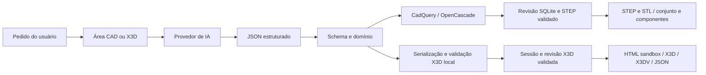

# Arquitetura do Forma

Baseline de 2026-10-02. Contratos em [PRD.md](../PRD.md); próximos trabalhos em [ISSUES.md](../ISSUES.md).

## Dois agentes

`WorkspaceShell` mantém navegação, saúde dos motores e um provedor configurado. CAD é a entrada padrão. A sessão X3D só é criada quando essa área é visitada. As áreas conservam seus estados durante a troca de abas; uma geração bloqueia a troca para evitar concorrência no provedor.

`CadAgentController` depende somente do provedor e das verificações CAD. `ChatController` trata somente ModelPlan/ModelSpec e sessões X3D. As áreas CAD e X3D são carregadas sob demanda. O runtime WebLLM existe apenas em `packages/agent`; `apps/web/src/ai` adapta seu estado e seleciona o provedor.

`cad-response-metadata.ts` define os tipos de `question` e `assumptions` para programas, peças legadas, planejamento de conjuntos e perguntas de edição. Texto explicativo não tem limite editorial de caracteres ou quantidade; o agente conserva a resposta completa sem cortar premissas. O schema de geração e a validação local usam o mesmo contrato de metadados. Dimensões, IDs, operações, limites geométricos e validação pelo motor permanecem independentes; textos de tipo incorreto continuam inválidos. Limites de transporte/contexto/saída do provedor continuam aplicáveis.

`LocalCliProvider` implementa a mesma interface para Codex/Claude Code. `api/local_ai.py` resolve os clientes oficiais instalados, verifica autenticação de assinatura e os chama por argumentos fixos/stdin, em diretórios temporários. Codex ignora configuração e regras do usuário, usa sandbox read-only e desabilita ferramentas; Claude usa safe-mode, nenhuma ferramenta e MCP vazio. Nenhum shell intermediário, código de IA ou token é recebido pela ponte. O cliente produz o JSON diretamente na mensagem final, sem o antigo envelope de JSON serializado como string. Codex entrega o arquivo de mensagem final; Claude entrega `result`. O schema completo segue no contexto e a resposta continua obrigatoriamente validada pelo domínio/motor. Isso evita o custo de dupla codificação e as restrições de schema do CLI. `temperature` e orçamento de saída do provedor HTTP não são opções desta ponte: valem os limites do cliente nativo.

As rotas `/api/ai/local/status/{client}` e `/generate` exigem endereço e Host loopback e Origin permitido, quando presente. Uma geração ativa por servidor; desconexão/timeout encerram a árvore do processo. Chaves de API e seletores de provedores de nuvem não são herdados pelo filho. Respostas incompletas ou uso inesperado de ferramentas não são aceitos. Erros seguros distinguem quota, login, modelo, indisponibilidade e formato; não há retentativa automática nesta ponte. O diálogo testa configurações não salvas em uma instância independente; somente aplicar troca o provedor dos agentes. A integração depende da instalação e versão dos clientes oficiais.

A política opcional `generationPolicy` pertence ao provedor e atravessa os adaptadores/controladores. Somente os clientes de assinatura a definem: falha de formato/schema interrompe sem outra inferência; esclarecimentos não provocam reconsideração automática; uma peça rejeitada recebe no máximo uma correção completa adicional por ação explícita. Reparos determinísticos continuam sem uso de IA. A correção localizada de interferência pode solicitar um programa corrigido e, se esse programa ainda falhar, sua única correção adicional; a assinatura não provoca replanejamento automático de todo o conjunto. Em X3D, há no máximo uma correção de aplicação por plano, sem saltar para outros lotes após esgotar esse limite. Lotes válidos de cenas grandes continuam normalmente. Provedores sem essa política conservam seus orçamentos HTTP e fluxos anteriores de reparo/continuação.

JSON nativo sem fechamento não comprova limite de tokens: a mensagem distingue conteúdo incompleto de uma quota declarada pelo cliente. O provedor volta a `ready` após uma falha de geração para permitir retomada manual. Checkpoints CAD conservam planos, corpos concluídos e programas candidatos em falhas de provedor, cancelamento e indisponibilidade de inspeção nativa. Retomar a inspeção recuperada não refaz inferência de corpos já disponíveis. O controlador conserva também o último resultado nativo concluído até confirmação de salvamento: repetir o mesmo pedido após falha ao salvar não gera outra peça. Confirmação de salvamento, novo projeto ou alteração do pedido libera esse resultado; o fluxo externo não usa esse cache. Posições e movimentos inviáveis são rejeitados no planejamento antes da construção. Checkpoints são limitados e permanecem na memória da aba; reload não os conserva. As limitações aqui são da aplicação; os clientes oficiais e serviços podem ter suas próprias retentativas internas.

## CAD

`cad-features.ts` centraliza nomes, campos e convenções das quinze formas/operações. O agente usa esse catálogo para parsing e orientação; o editor apresenta campos específicos. `cad_features.py` constrói tubos, toros, rasgos, furos e lofts e aplica fillet/chamfer/shell. Acabamentos têm `op=modify`, seleção enumerada, posição/rotação zero e não admitem padrões. Sua saída é normalizada para o sólido, sem faces soltas que comprometam STEP.

`cad_threads.py` constrói a seção polar dos filetes e extrusões torcidas de no máximo uma volta, unidas em um sólido. A segmentação evita superfícies helicoidais longas que o kernel pode classificar incorretamente apesar de `isValid()`. Verificações de volume, área da seção, conectividade e validade impedem perder silenciosamente o perfil. Um cache LRU de dezesseis protótipos, copiados antes do uso, evita refazer roscas idênticas. Roscas internas são cortes do mesmo perfil com folga radial; não precisam de um furo liso prévio. O modelo representa perfis truncados, sem classes ISO certificadas.

Modelos Pydantic são a fonte dos schemas compartilhados 3.0/4.0. `scripts/generate-cad-schemas.py` regenera esses arquivos; testes detectam divergência e executam os mesmos exemplos nos validadores Python/TypeScript. A expansão é aditiva: specs existentes continuam aceitos. O schema compacto enviado ao modelo continua sem referências ou uniões complexas; o parser aplica depois o contrato completo e as regras geométricas.

Um `motion.factor` opcional multiplica o comando compartilhado por um grupo. Todos os membros desse grupo precisam declarar fatores para combinar unidades; sem fator, a compatibilidade anterior de unidades/range/valor permanece. O motor aplica os valores físicos antes de posicionar os corpos e nas mesmas amostras de colisão. A interface altera o comando de todos os membros juntos e exibe suas posições efetivas. Um fuso de mão direita com porca não rotativa usa fator angular `-360/(pitch*starts)` e fator linear `1`.

Um pedido novo passa pelo classificador peça/conjunto. O planejamento lista componentes e movimentos; cada corpo utiliza o mesmo gerador de programas. Edições preservam etapas/componentes existentes e submetem propostas a verificações geométricas. Reparos locais e novas propostas da IA são limitados. Falhas do provedor conservam checkpoints do plano, corpos concluídos e programa parcial, incluindo a etapa pendente e o orçamento de reparos concluídos. Retomar exige o mesmo pedido e contexto na mesma aba; os candidatos são novamente verificados pelo motor. Os controladores mantêm identidade ao trocar a configuração do provedor, sem reload e sem perder a sessão/cena X3D. Checkpoints não são revisões salvas e não sobrevivem a recarregar ou fechar a aba.

Ao construir componentes, `generateCadProgram` recebe `assemblyComponent=true`. As instruções separam o pedido original das propostas dimensionais do plano: ajustes inferidos podem ser escolhidos no corpo atual para corresponder à geometria real já construída, mantendo requisitos explícitos, IDs e engate dos vínculos. O modo faz parte da chave de checkpoint do programa. No SDK legado, uma pergunta de componente conserva o checkpoint do conjunto e sua pergunta pendente; a retomada reenvia esse contexto somente ao corpo pendente. Perguntas ficam fora do cache de gerações concluídas. A interface usa o fluxo autônomo descrito abaixo.

O provedor compatível expõe `ProviderRequestError.limit` com categoria conhecida/desconhecida, código seguro e prazo opcional. Para 429, interpreta `Retry-After` e detalhes estruturados `RetryInfo`/`QuotaFailure`, sem exibir o corpo bruto. Limites diários, quota zero e faturamento não recebem retentativas automáticas; limites temporários com prazo de até 15 segundos recebem uma retentativa. Prazos mais longos são devolvidos imediatamente e impedem novas chamadas antes do horário informado. A aplicação não pode ampliar a quota da conta.

`cad_service.py` escolhe o adaptador pela versão do spec. Um cache LRU de oito resultados validados, indexado pelo spec completo e limite de bytes, evita reconstruir STEP na sequência inspeção/salvamento. Erros não ficam nesse cache. Adaptadores comparam sólidos, volumes e posições absolutas após exportação/reimportação.

O adaptador de conjuntos constrói cada sólido local uma vez por verificação. Posições e amostras de movimento transformam esses sólidos, sem repetir todo o histórico. A verificação ainda exige interseções reais de pares com caixas sobrepostas.

Uma falha de interferência contém, em `details`, o diagnóstico `assembly_interference` versão 1.0 com todas as colisões por par/pose, volumes e limites absolutos. A mensagem anterior continua disponível. O cliente valida esse contrato antes de permitir progresso parcial; erros antigos somente em texto exigem resolução completa de cada candidato.

`assembly-repair.ts` concentra a política de aceitação das estratégias locais. Cada candidato é submetido ao motor: um par/pose novo ou um aumento de interferência rejeita a proposta; uma redução comprovada mantém o avanço para tratar as colisões restantes. A comparação tolera apenas ruído numérico de 0,001 mm³ ou uma parte por milhão, sem alterar os limites de aceitação da API. Specs já avaliados não se repetem; há no máximo 16 avanços e 48 verificações de peças/conjuntos. O checkpoint conserva cada avanço aceito, inclusive antes de uma falha de rede posterior. Um resultado parcial continua sendo rascunho inválido; reparos da IA e eventual replanejamento recebem o melhor spec disponível.

O banco guarda spec e STEP exatos por revisão. STL e componentes derivam desse STEP salvo. A ordem dos corpos e sua correspondência com componentes são verificadas na reimportação. Não há reconstrução por IA durante downloads.

`assembly-fits.ts` substitui os reparos antigos que abriam uma cavidade somente em Z ou aumentavam arbitrariamente qualquer corte cilíndrico do par. Recebe a colisão estruturada do coordenador e deriva o eixo global da peça cilíndrica, respeitando a ordem das rotações X/Y/Z e as translações dos componentes. Um furo existente próximo pode ser realinhado e aprofundado; na ausência dele, somente guias alongadas ou corpos cilíndricos contidos justificam uma proposta. O furo atravessa o envelope do receptor e usa folga radial inferida de 0,2 mm. Furos com rebaixo/escareado são conservados com um corte complementar; cortes roscados próximos bloqueiam o reparo liso. O receptor pode ser fixo ou deslizar ao longo do eixo; um eixo rotativo precisa girar sobre sua própria linha. Geometrias compostas arbitrárias, movimentos transversais e órbitas ficam para o planejamento da IA. Estimativas limitam a remoção proposta; a peça deve continuar conectada e o conjunto precisa comprovar progresso em todas as amostras antes de aceitar a proposta. A estratégia não certifica tolerâncias de fabricação.

A prévia CAD é uma malha WebGL. Requisições obsoletas são abortadas e alterações são agrupadas por 400 ms. Um rascunho inválido mantém a malha anterior com aviso. Baixar um conjunto inválido como JSON permite reproduzir falhas.

`assembly-thread-fits.ts` precede os reparos cilíndricos e usa os mesmos validadores e coordenador nos provedores nativos/externos. Identifica uma rosca externa e um corte interno sem padrões, com diâmetro nominal, passo, perfil, sentido e entradas iguais. Infere um corte passante somente quando o receptor está engatado no comprimento da rosca externa. Alinha o corte ao eixo global, ao centro do receptor e à fase helicoidal, considerando coordenadas locais, posições e rotação/translação atuais. `cad-spatial.ts` compartilha vetores e a composição de rotações X/Y/Z: fase é uma rotação sobre o eixo real da rosca, preservando o referencial inteiro, inclusive em eixos inclinados.

O receptor pode ser fixo ou deslizar coaxialmente. O fuso pode ser fixo ou ter movimento coaxial; taxas angulares/lineares e grupos precisam manter a fase relativa segundo o avanço `pitch*starts`. A extensão do cortador interno ultrapassa cada face em pelo menos 1 mm quando seu comprimento anterior não basta. Folga radial é conservada, ou inferida em até 0,1 mm respeitando `pitch/4`. Parâmetros incompatíveis, órbitas e movimentos incoerentes ficam para correção explícita; a estratégia não troca o passo ou aumenta arbitrariamente o diâmetro nominal.

Uma união de cilindro liso maior que a raiz da rosca preenche seus sulcos. Quando o histórico mostra cilindros coaxiais contínuos anteriores à rosca, sem outras uniões ambíguas no trecho, a estratégia insere um corte anular imediatamente antes da rosca positiva, limitado ao seu comprimento. A raiz é `diameter - 2*pitch*0.613434654` no perfil métrico e `diameter - pitch` no trapezoidal. O núcleo remanescente fica 0,002 mm menor no diâmetro para garantir sobreposição positiva na união; a rosca repõe a geometria real da raiz. Os cilindros originais e seus munhões externos ficam intactos. Um alívio anterior equivalente não é repetido. Cada componente alterado passa pelo motor e o conjunto precisa comprovar progresso sem novas/piores colisões em nenhuma amostra. Cortes retangulares genéricos não são propostos em corpos com roscas; o reposicionamento de tampas não se aplica a dois corpos roscados. Essas inferências continuam sem certificação de ajuste ou validação contínua do movimento.

Conjuntos pausados por `CadAssemblyPausedError` transportam uma cópia do último conjunto aceito pelo coordenador, disponível para download JSON. O painel importa esse contrato após validação do domínio, sem inferência e sem habilitar exportações até salvar uma revisão aprovada. Na assinatura, o reparo de componente verifica somente o sólido desse componente; o coordenador verifica depois o conjunto inteiro. Uma redução comprovada pelo diagnóstico completo é conservada mesmo com outro par pendente; ausência de progresso conserva o conjunto anterior. A próxima ação usa o diagnóstico atualizado. O comportamento de reparo dos provedores externos permanece separado.

`repairCadAssembly` aciona o mesmo coordenador com `repairOnly`, usando os componentes existentes como ponto de partida. Não chama classificador, planejador ou geradores de componentes previamente à inspeção. Os checkpoints desse modo são separados dos de edição geral. A correção não replaneja o conjunto inteiro; se ainda houver falhas, o rascunho fica disponível e a retomada conserva o diagnóstico atualizado.

Para programas existentes dos clientes locais, o contrato de geração é `decision=edit`, `partId`, `replaceSteps`, `insertSteps`, `removeStepIds`, `question` e `assumptions`. `cad-program-patch.ts` aplica substituições somente a IDs conhecidos, conserva todos os passos omitidos, insere recursos após um ID existente/recém-inserido e rejeita referências desconhecidas, duplicadas ou conflitantes. Exclusões explícitas ainda passam pelas regras de preservação; instruções negativas de remoção não são autorização. O resultado usa o contrato CAD 3.0 completo e passa pelos validadores anteriores. Respostas legadas completas continuam aceitas com as mesmas regras de preservação. Geração de peças novas e provedores externos mantêm o schema completo de saída; nenhum contrato HTTP de CAD foi alterado.

O envelope de encaixe cilíndrico permanece aplicável após operações subtrativas, acabamentos e uniões de cilindros/cones coaxiais sem padrões e sem aumentar o raio original. Uniões deslocadas, transversais ou mais largas bloqueiam essa inferência. As verificações reais do sólido e das interferências continuam decidindo a aceitação.

`cad_assembly_adapter.py` usa `BRepBndLib.Add` para caixas conservadoras na rejeição inicial de pares separados. Interseções, volumes e limites exatos dos pares com colisão continuam calculados no kernel. Caixas e resultados são compartilhados apenas dentro de uma inspeção, por componente e valor do movimento, evitando recalcular pares fixos nas seis poses; cada pose mantém seu diagnóstico. A construção de programas só calcula caixas de diagnóstico quando uma operação falha ou não altera material. Não há prazo rígido nem cancelamento garantido do kernel; um único cálculo complexo ainda pode levar minutos.

`cad_mesh.py` compartilha a tesselação da prévia entre peça e conjunto. Tenta tolerâncias angulares de 0,3/0,6/0,9 rad com tolerância linear de 0,5 mm, mantendo até 50.000 triângulos e todos os corpos. Usa cópias sem malha antiga para que uma tesselação mais fina anterior não invalide o orçamento. Essa simplificação pertence apenas à prévia: STEP e STL continuam seguindo as verificações e tolerâncias de exportação.

## X3D

O ModelPlan é aplicado deterministicamente ao ModelSpec; schema e regras do domínio são verificados antes da geração. `connect_x3d` seleciona `LocalX3DBackend` por padrão ou `X3DMcpClient` com `X3D_BACKEND=mcp`.

O backend local escreve XML com ElementTree, preservando escala de unidades, rotação, material e enquadramento. Usa diretamente validadores XSD, semânticos e correções de containerField do upstream fixado. Trabalho síncrono roda fora do event loop; um lock protege os validadores compartilhados. Não são necessários servidor externo, sessão MCP ou HTTP para construir uma cena local.

A revisão é publicada apenas após validação. Artefatos têm chave de projeto/revisão, cache limitado, TTL e compartilhamento de requisições concorrentes. Uma requisição antiga não recebe conteúdo de uma revisão nova. HTML fica em iframe sandbox, sem entrar no DOM principal. X3DOM 1.8.2 é carregado externamente também no HTML exportado.

`check_scene_layout` centraliza a política espacial da requisição: `overlapPolicy=visual` por padrão e `strict` para separação global explícita. A análise usa caixas alinhadas aos eixos após rotação/escala, sem calcular interseções exatas entre superfícies. Em modo visual, registra até dez pares e um resumo do total em `validation.warnings`; não modifica posições nem ignora validação XSD/semântica. Esses avisos ficam associados à revisão e aparecem na recuperação da sessão.

Em modo estrito, a API rejeita sobreposições mesmo se o plano usar `allowOverlap=true`. O erro inclui diagnóstico `x3d_layout` 1.0 com IDs de até mil pares, contagem total e indicador de truncamento. O agente recebe os pares disponíveis além da mensagem humana limitada a dez. O fluxo da interface não pede deslocamento automático; a opção legada `resolveOverlaps` segue disponível para callers que a solicitarem explicitamente. O SDK também exige opt-in para esse deslocamento.

O navegador permite selecionar “Exigir separação entre todos os objetos” para um pedido. A política visual não transforma frases como “caixas sem sobreposição” numa restrição global: o planejamento deve respeitar o escopo do pedido, enquanto os avisos ajudam a revisar a composição. Não há garantia de ausência de colisões exatas entre objetos X3D.

## Persistência e fronteiras

`CadAssemblySpec.mechanics` estende o contrato 4.0 de forma compatível: projetos sem esse campo continuam geométricos. TS/Python validam IDs, referências de recursos, ancoragem fixa, métodos de fixação e grafo conectado. O planejador gera esse contrato antes dos componentes e envia seus pares/IDs e o plano completo de posições a cada construtor. A interface usa `requireMechanics=true` por padrão; callers legados do SDK podem manter conceitos geométricos. Edições não podem descartar silenciosamente vínculos existentes; o modo de verificação faz parte das chaves de checkpoint/resultado concluído.

`cad_mechanics.py` recebe os mesmos sólidos/poses utilizados na análise de interferência, sem reconstruí-los. Aplica transformações locais/globais e os movimentos ao interpretar cada recurso. Contatos planos usam interseção de faces opostas; furos passantes de montagem precisam ter material ao redor e estar abertos. Pares eixo/furo verificam eixo, folga radial e engate, além de material em quatro direções e três estações axiais. Um recurso positivo construído/validado pelo motor e seguido exclusivamente de uniões conserva seu material por construção; pontos positivos desse recurso não precisam ser reclassificados. Cortes/acabamentos posteriores exigem classificação real, e vales de rosca precisam permanecer expostos. Classificadores de sólido são reutilizados apenas dentro dessa inspeção, preservando a semântica `inside/on face` do CadQuery e evitando reconstrução por ponto. Provas de captura/retenção usam pequenas perturbações com interseções válidas; batentes rotativos são verificados em todas as poses amostradas. Grupos são confrontados com o avanço/sentido da rosca e apoios necessários a cada tipo de movimento. Peças fixadas que giram com o mesmo fator/comando e eixo global coaxial formam um grupo rígido; a prova de retenção usa a geometria composta desse grupo, permitindo ressaltos e volantes removíveis.

Falhas mecânicas retornam `CAD_MECHANICS_INVALID` e diagnóstico `assembly_mechanics` 1.0. Quando há colisões também, `assembly_interference` inclui `mechanicalIssues`. O coordenador recusa reparos que acrescentem ou alterem defeitos mecânicos, mesmo que diminuam o volume de interseção. Inspeção, prévia e salvamento com contrato passam pelo mesmo verificador; nenhuma revisão inválida é persistida. `POST /api/cad/assemblies/mechanics` oferece inspeção sem IA: verifica o contrato presente ou retorna `unverified` e distâncias entre corpos fixos para dados antigos. Inspeções/revisões identificam `mechanicalStatus` explicitamente.

O perfil aceita fixação parafusada/adesiva/capturada, guias cilíndricas, mancais lisos e fuso rotativo com carro guiado. Não dimensiona fixadores, cargas, vida útil, processo de fabricação ou sequência de instalação e não substitui um solver geral de mates. [mechanical-assemblies.md](mechanical-assemblies.md) define o alcance exato.

`cad-schema.ts` compila os schemas CAD compartilhados para os validadores TypeScript. JSON importado também passa pela estrutura estrita: propriedades desconhecidas, coordenadas ausentes e IDs de tipos incorretos são recusados no cliente. O planejamento aplica as regras de grupos/ranges/fatores com componentes provisórios antes de solicitar sua geometria. Intervalos ligados disjuntos e mistura de fatores explícitos/ausentes são rejeitados. O contexto de construção inclui todos os passos e movimentos disponíveis, incluindo roscas positivas, uniões e acabamentos.

Os reparos de encaixes usam `commandAtPose` para interpretar coordenadas nas poses do diagnóstico, incluindo extremidades do curso. `assembly-motion-clearance.ts` infere um cortador cilíndrico a partir de cilindros/cones positivos coaxiais de um corpo móvel. Em movimentos rotativos/de parafuso, esses recursos precisam estar no eixo de rotação local. O envelope inclui a translação extrema e margens de 0,2 mm. O receptor precisa ser fixo, ter cortes existentes e não ter roscas; a caixa do material potencialmente removido deve caber em 15% do volume. A estratégia nunca modifica o corpo móvel, seu curso ou posições. O coordenador exige validação da peça e progresso sem regressões em todas as amostras. Correções por IA escolhem preferencialmente o corpo fixo/receptor e recebem todas as colisões desse componente, inclusive no curso. Uma redução comprovada é conservada também nos provedores externos.

O kernel rejeita interseções topologicamente inválidas e volumes não finitos. Cada resultado booleano continua sendo validado, mas não passa repetidamente pela mesma verificação topológica sem alteração. Volumes de componentes rígidos são reutilizados entre poses e pares na mesma inspeção. Isso reduz trabalho redundante, sem criar um prazo ou cancelamento garantido do kernel.

A recuperação da peça e do conjunto usa resultados independentes. `useAgentProvider` ignora eventos/conclusões de um provedor após substituição. No cache X3D, a própria tarefa de construção armazena o resultado e remove sua entrada de trabalho em `finally`, mesmo sem clientes aguardando; falhas são consumidas e não ficam retidas. Excluir um projeto impede que uma tarefa tardia republique seu artefato. Clientes de IA recebem um grupo de processos separado em POSIX; timeout/cancelamento encerra o grupo inteiro. Windows conserva encerramento por árvore com `taskkill`.

| Informação | Armazenamento | Duração |
|---|---|---|
| CAD: specs, inspeções e STEP | SQLite `cad.sqlite3` | Entre reinícios |
| Receitas X3D | SQLite `recipes.sqlite3` | Entre reinícios |
| Sessões/cenas X3D e artefatos | Memória da API | Até expirar, excluir ou reiniciar |
| Seleção, IDs e provedor | localStorage | Até limpar o navegador |
| Componentes em geração interrompida | Memória da aba | Até recarregar/fechar |

A IA nunca fornece código executável, shell, HTML ou XML. A aplicação interpreta operações tipadas; schema, domínio e motor são fronteiras diferentes. Clientes HTTP ficam separados em `api/cad.ts`, `api/x3d.ts`, `api/health.ts` e `api/legacy-cad.ts`; `api/http.ts` centraliza erros e downloads. Chaves do provedor ficam no navegador. A API não tem contas nem propriedade por usuário e foi desenhada para uso privado.

Contratos CAD 2.x e suas rotas continuam disponíveis para revisões antigas. A interface de moldes foi retirada; projetos novos usam programas 3.0 e conjuntos 4.0. Não existe conversão automática de cena X3D para sólido CAD.

## Decisões CAD autônomas

Todas as ações CAD de `CadAgentController` ativam `noQuestions=true`. `cad-autonomy.ts` exclui `clarify` do schema e exige `question` vazio, mantendo envelopes de criação ou edição incremental. Clientes que ignoram o schema têm a pergunta interceptada: o coordenador acrescenta a delegação de decisões e permite até duas respostas adicionais, sem devolvê-la à interface. Insistência termina em `CadAutonomyError`, sem repetir indefinidamente nem aprovar geometria inválida. O contexto pendente fica em um WeakMap por provedor com até oito entradas; quota/cancelamento conservam esse contexto e a retomada começa na decisão pendente, sem repetir a resposta inicial. Perguntas de SDKs legados também possuem uma defesa na interface que apresenta falha técnica em vez do texto de autorização.

`cad-mating.ts` compara eixos globais e intervalos de engate dos recursos disponíveis nas seis poses antes da inspeção nativa do componente. A construção de uma guia curta recebe esse diagnóstico durante o próprio passo e pode corrigi-la antes de gerar outros corpos. Esta checagem não comprova material nem contato: a inspeção final pelo kernel permanece obrigatória. Quando a validação completa exige modificar peças anteriores, o modo autônomo permite um único replanejamento seletivo; falhas de provedor conservam o spec e os checkpoints. `repairOnly` conserva o caminho de reparo direto, sem replanejar. Estas chamadas internas são distintas dos reparos de formato, cuja política continua pertencendo ao provedor.
